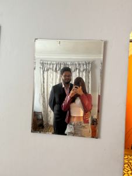

  

<strong>Universidad Peruana de Ciencias Aplicadas</strong>

<strong>Ingeniería de Software</strong> 
Aplicaciones Web  
<strong>Profesor:</strong> Alex Humberto Sánchez Ponce 

<h2 align="center">INFORME</h2>

<h3 align="center">Startup: Qahwa</h3>

<h3 align="center">Team Members:</h3>

| **Member**                           | **Code**     |
|--------------------------------------|--------------|
|João Otavio de Carvalho Saito      |  U202020107  |
|Esteban Valentino Alvarez Falen        |  U202315628 |
| Stephano Renan Valdivia Quispe         |  U202311294 |
|Jhordi Luis Carranza Pérez       | U20191E835 |

<strong>Mayo 2025</strong>

# Project Report Collaboration Insights
Link del repositorio: https://github.com/Qahwa-Grupo3/Report.git

# Capítulo 1: Introducción

## 1.1. Startup Profile

| **Criterio específico**                                    | **Acciones realizadas**                                                                                                                                                                                                                                                                                                                                                                                                                                                                                                                                                                                                                                                               | **Conclusiones**                                                                                                                                                                                                                                                                                                                                                                         |
|------------------------------------------------------------|----------------------------------------------------------------------------------------------------------------------------------------------------------------------------------------------------------------------------------------------------------------------------------------------------------------------------------------------------------------------------------------------------------------------------------------------------------------------------------------------------------------------------------------------------------------------------------------------------------------------------------------------------------------------------------------|------------------------------------------------------------------------------------------------------------------------------------------------------------------------------------------------------------------------------------------------------------------------------------------------------------------------------------------------------------------------------------------|
| Comunica oralmente con efectividad a diferentes rangos de audiencia | **Jhordi Luis Carranza Pérez – TB1:** - Conduje entrevistas a usuarios para profundizar en sus problemas y expectativas. - Presenté hallazgos y propuestas al equipo durante las reuniones sincrónicas.  **João Otavio de Carvalho Saito – TB1:** - Expliqué a los stakeholders la estructura y flujos de la nueva landing page. - Coordiné oralmente la distribución de tareas de diseño con el equipo.  **Esteban Valentino Alvarez Falen – TB1:** - Lideré sesiones de entrevistas al usuario para validar supuestos de valor. - Compartí públicamente los resultados durante la retrospectiva del sprint.  **Stephano Renan Valdivia Quispe – TB1:** - Facilité entrevistas y defendí ajustes en la arquitectura ante el equipo. - Resumí verbalmente los mapas de proceso delante de compañeros y docente. | - Las entrevistas reforzaron mi capacidad para adaptar el lenguaje técnico a usuarios no especialistas y sintetizar ideas en tiempo real. - Aprendí a exponer conceptos visuales (mock-ups, wireframes) de forma clara y a recoger feedback inmediato para iterar rápido. - Desarrollé confianza para dirigir conversaciones guiadas y obtener información crítica manteniendo la atención de la audiencia. - Perfeccioné mi habilidad de traducir datos en narrativas comprensibles para audiencias mixtas (técnicas y de negocio). |
| Comunica por escrito con efectividad a diferentes rangos de audiencia | **Jhordi Luis Carranza Pérez – TB1:** - Elaboré diagramas de flujo y tablas de requerimientos. - Documenté historias de usuario y apuntes de las entrevistas.  **João Otavio de Carvalho Saito – TB1:** - Redacté el contenido textual de la landing page (mensajes de marketing y FAQ). - Diseñé wireframes y mock-ups anotados en Figma.  **Esteban Valentino Alvarez Falen – TB1:** - Construí tablas comparativas y mapas de empatía del usuario. - Documenté los criterios de priorización para el backlog.  **Stephano Renan Valdivia Quispe – TB1:** - Redacté la sección de documentación funcional y mapas de navegación. - Consolidé notas de entrevistas en un reporte de hallazgos. | - La redacción estructurada me permitió transmitir información técnica de manera accesible al docente y al equipo de diseño. - Aprendí a comunicar propuestas de valor y guías visuales que cualquier colaborador pueda entender sin asistencia oral. - El uso de plantillas estandarizadas hizo más eficiente el intercambio de información y la toma de decisiones. - Mejoré la coherencia y el nivel de detalle en documentos dirigidos tanto a profesores como a compañeros de distintas áreas. |

### 1.1.1. Descripción de la Startup

**Qahwa** es una startup orientada al desarrollo de soluciones digitales para pequeños y medianos productores de café en el Perú. Nuestro objetivo es digitalizar y optimizar todo el proceso productivo del café (desde la preparación del terreno hasta la comercialización del grano) a través de una aplicación web intuitiva y accesible. Buscamos contribuir al crecimiento del sector cafetalero (recordemos que nuestro país es un importante productor de café en el mundo) brindando herramientas que faciliten el seguimiento de cultivos, el control de cosechas y la mejora en la toma de decisiones comerciales.

**Misión:**  
Impulsar el desarrollo sostenible del sector cafetalero peruano mediante soluciones digitales accesibles e innovadoras que optimicen cada etapa del proceso productivo del café, desde el cultivo hasta su comercialización, empoderando a pequeños y medianos productores con tecnología fácil de usar.

**Visión:**  
Ser la plataforma digital líder en el fortalecimiento del café peruano a nivel nacional e internacional, transformando la manera en que los productores gestionan, controlan y comercializan su café, promoviendo un sector más competitivo, eficiente y justo.

**Valores:**

- **Compromiso con el productor:** Ponemos al caficultor en el centro de nuestras soluciones, entendiendo sus desafíos y necesidades reales.
- **Innovación con propósito:** Desarrollamos herramientas tecnológicas útiles y aplicables al contexto rural y cafetalero peruano.
- **Accesibilidad y simplicidad:** Creamos plataformas intuitivas, pensadas para ser utilizadas sin barreras técnicas.
- **Sostenibilidad:** Promovemos prácticas responsables con el medio ambiente y el desarrollo a largo plazo del sector cafetalero.
- **Transparencia:** Fomentamos procesos claros y decisiones informadas para mejorar la comercialización y confianza en la cadena de valor.
- **Identidad peruana:** Valoramos y promovemos el café peruano como producto de orgullo nacional y de calidad internacional.

### 1.1.2. Perfiles de integrantes del equipo

<table border="1" cellspacing="0" cellpadding="8">
  <tr>
    <td></td>
    <td>
      <strong>Nombres y apellidos:</strong> Jhordi Luis Carranza Pérez 
      <strong>Código de estudiante:</strong> U20191835 
      <strong>Carrera:</strong> Ing. de Software 
      <strong>Descripción:</strong> Soy una persona que me gusta cumplir con mis obligaciones de manera efectiva, aunque muchas veces me descuide un poco. Mis conocimientos técnicos van en torno a Programación Web, bases de datos, lenguajes de alto y bajo rendimiento como C++, Python y JavaScript.
    </td>
  </tr>
  <tr>
    <td></td>
    <td>
      <strong>Nombres y apellidos:</strong> João Otavio de Carvalho Saito 
      <strong>Código de estudiante:</strong> U202020107 
      <strong>Carrera:</strong> Ing. de Software 
      <strong>Descripción:</strong> Soy una persona dedicada, activa y determinada. Muchas veces me sobrecargo de cosas que hacer y termino descuidando los detalles. Tengo conocimientos en C++, Python, Unity y modelado 3D.
    </td>
  </tr>
  <tr>
    <td></td>
    <td>
      <strong>Nombres y apellidos:</strong> Esteban Valentino Alvarez Falen 
      <strong>Código de estudiante:</strong> U202315628 
      <strong>Carrera:</strong> Ing. de Software 
      <strong>Descripción:</strong> Soy estudiante de la UPC de la carrera de ingeniería de software, me encantan los videojuegos y la música, espero terminar a futuro mis metas y lograr todo con satisfacción.
    </td>
  </tr>
  <tr>
    <td></td>
    <td>
      <strong>Nombres y apellidos:</strong> Stephano Renan Valdivia Quispe 
      <strong>Código de estudiante:</strong> U202311294 
      <strong>Carrera:</strong> Ing. de Software 
      <strong>Descripción:</strong> Me considero una persona determinada y paciente. Tengo conocimientos en C++, Python, Java, base de datos, desarrollo web y más.
    </td>
  </tr>
</table>

## 1.2. Solution Profile

### 1.2.1. Antecedentes y problemática

En el Perú, muchos pequeños y medianos productores de café enfrentan grandes desafíos en la gestión de sus procesos agrícolas y comerciales, especialmente en aquellos donde los recursos tecnológicos son limitados o sencillamente no cuentan con ellos. La falta de digitalización de sus cultivos, cosechas y ventas genera pérdidas económicas, baja productividad y una limitada trazabilidad del producto final. Además, los registros manuales son propensos a errores y dificultan la toma de decisiones informadas sobre el negocio cafetalero.

#### Puntos clave a resolver con la solución:

- Digitalizar el registro de actividades de campo (preparación del terreno, siembra, cosecha, etc.).
- Facilitar el seguimiento de procesos en vivero, cultivo, cosecha y postcosecha.
- Automatizar el control de inventario de sacos y estado de humedad del grano.
- Centralizar la información sobre clientes, ventas y precios del café.
- Generar reportes sobre productividad, estado del cultivo y desempeño comercial.

#### Objetivos del proyecto:

- Creación de una página web accesible y fácil de usar para productores de café.
- Ofrecer una interfaz clara que pueda ser usada incluso por usuarios sin experiencia.
- Permitir la visualización de reportes e historial de actividades agrícolas.

#### Restricciones del proyecto:

- El sistema estará enfocado inicialmente en los pequeños productores (sectores rurales del Perú).

### Análisis 5W2H

#### 1. WHO (¿Quién?)

- Pequeños y medianos productores de café en el Perú, principalmente en zonas rurales de la sierra y ceja de selva.
- También incluye técnicos agrícolas, cooperativas cafetaleras e intermediarios en la cadena de valor del café.

#### 2. WHAT (¿Qué?)

- La problemática central es la falta de digitalización y organización en el seguimiento de las etapas del proceso cafetalero (siembra, cultivo, cosecha, poscosecha y venta).
- Esto genera pérdidas económicas, poca trazabilidad del producto, baja eficiencia y dificultades en la toma de decisiones.

#### 3. WHERE (¿Dónde?)

- En las principales regiones productoras de café en el Perú: Cajamarca, Junín, San Martín, Amazonas, Cusco, entre otras.
- Ámbitos rurales con conectividad media o baja, pero con creciente acceso a dispositivos móviles.

#### 4. WHEN (¿Cuándo?)

- El problema ocurre de forma constante a lo largo de todo el año, especialmente en épocas clave como la siembra (marzo-abril) y la cosecha (mayo a octubre).
- La falta de registros históricos afecta tanto la planificación anual como el seguimiento de cada campaña cafetalera.

#### 5. WHY (¿Por qué?)

Porque muchos productores siguen usando registros manuales o no registran nada, debido a:

- Limitado acceso a herramientas tecnológicas adaptadas a su realidad.
- Falta de capacitación digital.
- Sistemas existentes demasiado complejos o costosos.

#### 6. HOW (¿Cómo sucede?)

- El productor realiza labores de campo sin una bitácora formal.
- No recuerda fechas exactas de fertilización, poda o tratamientos fitosanitarios.
- Al llegar la cosecha, vende su café sin poder demostrar la calidad del proceso, lo que disminuye su capacidad de negociación en el mercado.
- Las ventas no quedan registradas y se pierde información valiosa para la trazabilidad del producto o evaluación del negocio.

#### 7. HOW MUCH (¿Cuánto afecta?)

- Según el MINAGRI, el 95% de los productores son pequeños agricultores, y muchos de ellos pierden entre 15% y 30% de su producción potencial por mala planificación o manejo técnico deficiente.
- Además, la falta de trazabilidad limita su acceso a mercados premium o exportadores, donde podrían vender su café a precios mucho más altos.

### 1.2.2 Lean UX Process

El enfoque Lean UX aplicado en este proyecto nos ha permitido definir una visión clara del modelo de negocio, identificar con precisión los problemas del usuario y plantear hipótesis que guíen el desarrollo de un sistema centrado en las necesidades reales de los productores cafetaleros.

#### 1.2.2.1 Lean UX Problem Statements

- **Domain (Dominio del problema):**  
  El dominio del problema es la gestión de procesos agrícolas y de comercialización en la producción de café peruano, especialmente en manos de pequeños productores con recursos limitados y sin acceso a herramientas digitales especializadas.

- **Customer Segments (Segmentos de clientes):**  
  - Pequeños productores de café.  
  - Técnicos agrícolas y asociaciones/cooperativas cafetaleras.  
  - Intermediarios y compradores.

- **Pain Points (Puntos de dolor):**  
  - Falta de digitalización en el control de procesos agrícolas.  
  - Escasa trazabilidad de la producción de café.  
  - Dificultades para registrar y analizar actividades agrícolas.  
  - Pérdida de oportunidades comerciales por no demostrar calidad del café.

- **Gap (Brecha identificada):**  
  Existe una desconexión entre el potencial del café peruano y la forma en que se gestiona su producción y venta, debido a la ausencia de herramientas tecnológicas simples, accesibles y adaptadas al entorno rural.

- **Vision / Strategy:**  
  Desarrollar una plataforma web accesible y fácil de usar, que permita a los caficultores registrar, organizar y monitorear todo el ciclo de producción y comercialización de su café, desde la siembra hasta la venta, fortaleciendo la trazabilidad, eficiencia y el acceso a mercados de valor.

- **Initial Segment:**  
  Nos enfocaremos inicialmente en productores cafetaleros de la región Cajamarca, que representan uno de los focos más importantes de producción nacional y tienen un alto nivel de organización local a través de cooperativas y asociaciones.

#### 1.2.2.2 Lean UX Assumptions

- Los productores cafetaleros están interesados en mejorar la gestión de sus cultivos y ventas.  
- La mayoría cuenta con acceso a un celular con internet o a centros de conectividad cercanos.  
- Prefieren soluciones simples, visuales y adaptadas a su nivel de alfabetización digital.  
- Las cooperativas o técnicos agrícolas pueden cumplir un rol clave en la adopción inicial del sistema.  
- Existe mercado para el café con trazabilidad comprobada.

#### 1.2.2.3 Lean UX Hypothesis Statements

- Si brindamos una plataforma web fácil de usar para registrar las actividades agrícolas, los productores cafetaleros podrán llevar un mejor control de su producción y reducir pérdidas por desorganización.

- Si los productores pueden demostrar la trazabilidad de su café, tendrán más oportunidades para acceder a mercados con mejores precios.

- Si los técnicos agrícolas pueden supervisar múltiples parcelas desde el sistema, se optimizará la asistencia técnica y el rendimiento productivo.

- Si los compradores tienen acceso a información detallada de cada lote de café, confiarán más en el producto y establecerán relaciones comerciales más directas y justas.

#### 1.2.2.4. Lean UX Canvas.

  

## 1.3 Segmentos Objetivos

### Segmento 1: Pequeños productores de café

**Descripción:**  
Agricultores que cultivan café a pequeña escala, generalmente en parcelas familiares de menos de 5 hectáreas. Utilizan métodos tradicionales y, en muchos casos, forman parte de cooperativas o asociaciones.

**Características con información estadística:**

- **Edad:**  
  - Entre 25 y 50 años (mayoría de la PEA agrícola rural).  
  - Según el Censo Agropecuario del Perú (2012), el 60% de los productores agropecuarios están en este rango de edad.

- **Nivel educativo:**  
  - 47.5% de los productores agrícolas tienen primaria completa o incompleta.  
  - 36% alcanzó secundaria (INEI – Censo Agropecuario, 2012).

- **Ubicación:**  
  - Zonas de alta producción cafetalera:  
    - Cajamarca (21%)  
    - San Martín (19%)  
    - Junín (15%)  
    - Cuzco (9%)  
    *(Fuente: Junta Nacional del Café, 2023)*  
  - Predominan en zonas rurales de sierra y ceja de selva.

- **Conectividad:**  
  - Solo el 30% de hogares rurales tiene acceso a internet.  
  - El 70% de los productores usa celulares, y el uso de smartphones está en aumento.  
  *(Fuente: INEI – Encuesta Nacional de Hogares, 2022)*  
  - Acceso creciente a plataformas como WhatsApp, Facebook y navegador móvil.

### Segmento 2: Compradores

**Descripción:**  
Personas naturales o jurídicas que adquieren café en grano para acopiarlo, procesarlo, comercializarlo localmente o exportarlo. Pueden operar individualmente o formar parte de cooperativas o compañías exportadoras.

**Características con información estadística:**

- **Edad:**  
  - Entre 30 y 55 años.  
  - Este rango coincide con la edad promedio de los micro y pequeños empresarios en Perú.  
  *(Fuente: Produce – 2021)*

- **Ubicación:**  
  - Principalmente en ciudades intermedias cercanas a zonas productoras:  
    - Jaén (Cajamarca)  
    - Tarapoto (San Martín)  
    - Satipo (Junín)  
    - Quillabamba (Cusco)  
  - También se ubican en centros de acopio, puertos o zonas industriales de:  
    - Lima  
    - Callao  
    - Arequipa  
    - Chiclayo  
    - Trujillo

- **Conectividad:**  
  - Alta.  
  - Más del 85% de las MYPES en zonas urbanas usan internet.  
  *(Fuente: INEI, 2022)*  
  - Acceso a computadoras, redes móviles, plataformas de comercio electrónico y herramientas de trazabilidad y logística.
