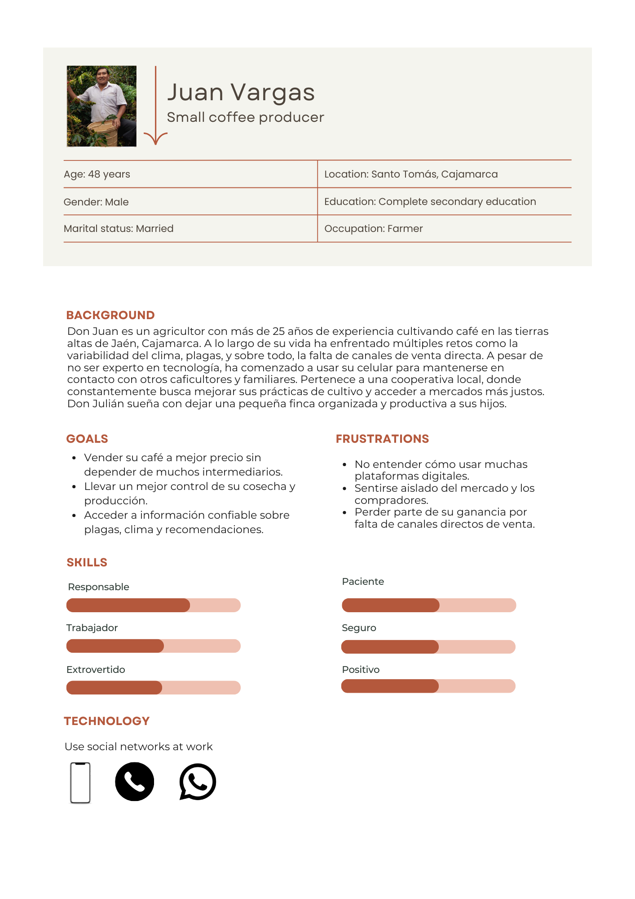
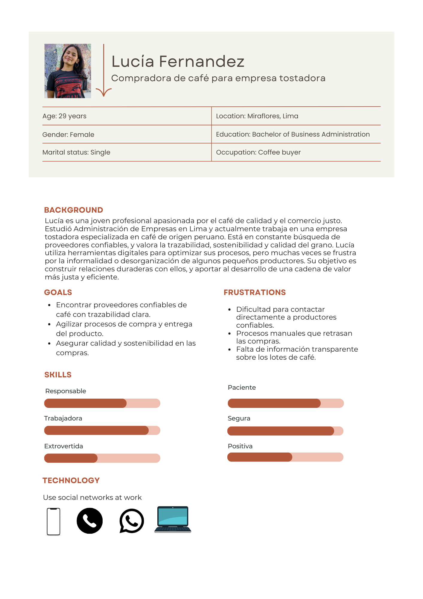
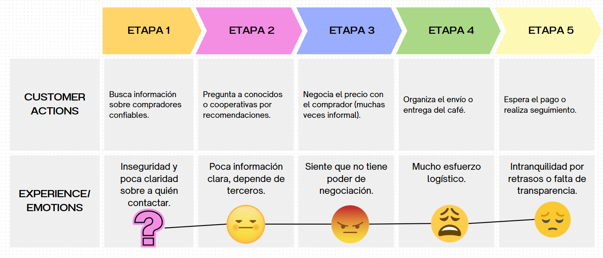
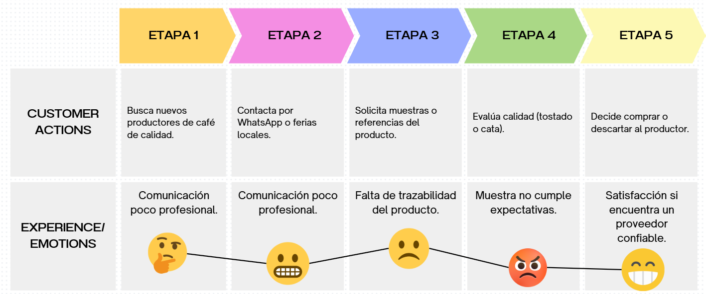
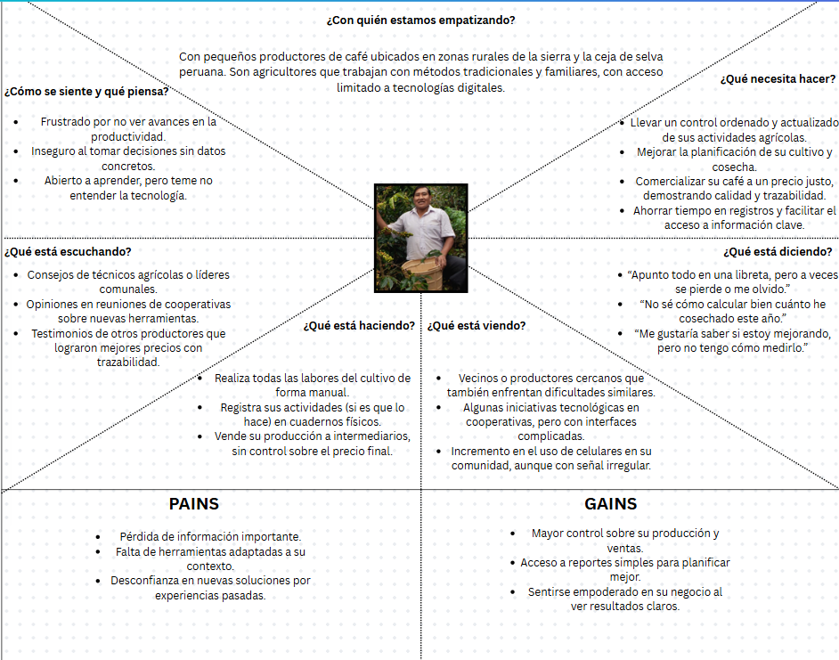
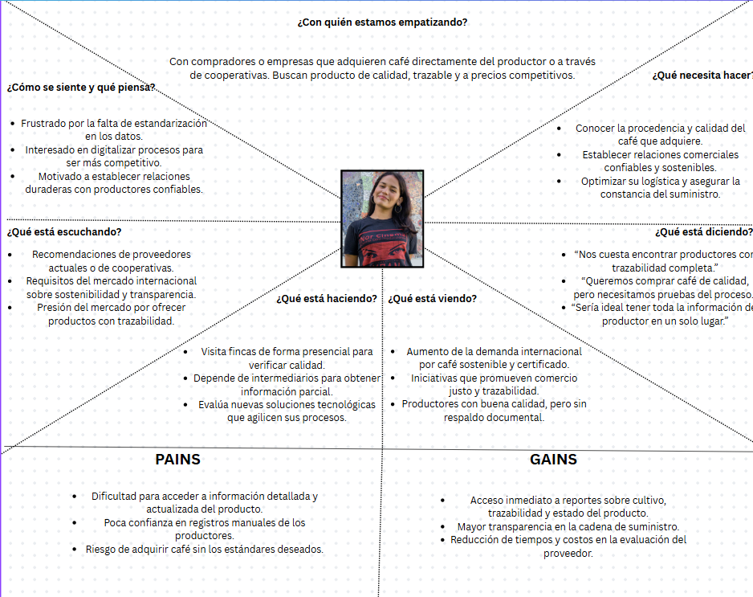

  

<strong>Universidad Peruana de Ciencias Aplicadas</strong>

<strong>Ingeniería de Software</strong> 
Aplicaciones Web  
<strong>Profesor:</strong> Alex Humberto Sánchez Ponce 

<h2 align="center">INFORME</h2>

<h3 align="center">Startup: Qahwa</h3>

<h3 align="center">Team Members:</h3>

| **Member**                      | **Code**   |
| ------------------------------- | ---------- |
| João Otavio de Carvalho Saito   | U202020107 |
| Esteban Valentino Alvarez Falen | U202315628 |
| Stephano Renan Valdivia Quispe  | U202311294 |
| Jhordi Luis Carranza Pérez      | U20191E835 |

<strong>Mayo 2025</strong>

# Project Report Collaboration Insights

Link del repositorio: https://github.com/Qahwa-Grupo3/Report.git

# Capítulo 1: Introducción

## 1.1. Startup Profile

| **Criterio específico**                                               | **Acciones realizadas**                                                                                                                                                                                                                                                                                                                                                                                                                                                                                                                                                                                                                                                                                                                                                                                                                                   | **Conclusiones**                                                                                                                                                                                                                                                                                                                                                                                                                                                                                                                              |
| --------------------------------------------------------------------- | --------------------------------------------------------------------------------------------------------------------------------------------------------------------------------------------------------------------------------------------------------------------------------------------------------------------------------------------------------------------------------------------------------------------------------------------------------------------------------------------------------------------------------------------------------------------------------------------------------------------------------------------------------------------------------------------------------------------------------------------------------------------------------------------------------------------------------------------------------- | --------------------------------------------------------------------------------------------------------------------------------------------------------------------------------------------------------------------------------------------------------------------------------------------------------------------------------------------------------------------------------------------------------------------------------------------------------------------------------------------------------------------------------------------- |
| Comunica oralmente con efectividad a diferentes rangos de audiencia   | **Jhordi Luis Carranza Pérez – TB1:** - Conduje entrevistas a usuarios para profundizar en sus problemas y expectativas. - Presenté hallazgos y propuestas al equipo durante las reuniones sincrónicas.  **João Otavio de Carvalho Saito – TB1:** - Expliqué a los stakeholders la estructura y flujos de la nueva landing page. - Coordiné oralmente la distribución de tareas de diseño con el equipo.  **Esteban Valentino Alvarez Falen – TB1:** - Lideré sesiones de entrevistas al usuario para validar supuestos de valor. - Compartí públicamente los resultados durante la retrospectiva del sprint.  **Stephano Renan Valdivia Quispe – TB1:** - Facilité entrevistas y defendí ajustes en la arquitectura ante el equipo. - Resumí verbalmente los mapas de proceso delante de compañeros y docente. | - Las entrevistas reforzaron mi capacidad para adaptar el lenguaje técnico a usuarios no especialistas y sintetizar ideas en tiempo real. - Aprendí a exponer conceptos visuales (mock-ups, wireframes) de forma clara y a recoger feedback inmediato para iterar rápido. - Desarrollé confianza para dirigir conversaciones guiadas y obtener información crítica manteniendo la atención de la audiencia. - Perfeccioné mi habilidad de traducir datos en narrativas comprensibles para audiencias mixtas (técnicas y de negocio). |
| Comunica por escrito con efectividad a diferentes rangos de audiencia | **Jhordi Luis Carranza Pérez – TB1:** - Elaboré diagramas de flujo y tablas de requerimientos. - Documenté historias de usuario y apuntes de las entrevistas.  **João Otavio de Carvalho Saito – TB1:** - Redacté el contenido textual de la landing page (mensajes de marketing y FAQ). - Diseñé wireframes y mock-ups anotados en Figma.  **Esteban Valentino Alvarez Falen – TB1:** - Construí tablas comparativas y mapas de empatía del usuario. - Documenté los criterios de priorización para el backlog.  **Stephano Renan Valdivia Quispe – TB1:** - Redacté la sección de documentación funcional y mapas de navegación. - Consolidé notas de entrevistas en un reporte de hallazgos.                                                                                                                 | - La redacción estructurada me permitió transmitir información técnica de manera accesible al docente y al equipo de diseño. - Aprendí a comunicar propuestas de valor y guías visuales que cualquier colaborador pueda entender sin asistencia oral. - El uso de plantillas estandarizadas hizo más eficiente el intercambio de información y la toma de decisiones. - Mejoré la coherencia y el nivel de detalle en documentos dirigidos tanto a profesores como a compañeros de distintas áreas.                                  |

### 1.1.1. Descripción de la Startup

**Qahwa** es una startup orientada al desarrollo de soluciones digitales para pequeños y medianos productores de café en el Perú. Nuestro objetivo es digitalizar y optimizar todo el proceso productivo del café (desde la preparación del terreno hasta la comercialización del grano) a través de una aplicación web intuitiva y accesible. Buscamos contribuir al crecimiento del sector cafetalero (recordemos que nuestro país es un importante productor de café en el mundo) brindando herramientas que faciliten el seguimiento de cultivos, el control de cosechas y la mejora en la toma de decisiones comerciales.

**Misión:**  
Impulsar el desarrollo sostenible del sector cafetalero peruano mediante soluciones digitales accesibles e innovadoras que optimicen cada etapa del proceso productivo del café, desde el cultivo hasta su comercialización, empoderando a pequeños y medianos productores con tecnología fácil de usar.

**Visión:**  
Ser la plataforma digital líder en el fortalecimiento del café peruano a nivel nacional e internacional, transformando la manera en que los productores gestionan, controlan y comercializan su café, promoviendo un sector más competitivo, eficiente y justo.

**Valores:**

- **Compromiso con el productor:** Ponemos al caficultor en el centro de nuestras soluciones, entendiendo sus desafíos y necesidades reales.
- **Innovación con propósito:** Desarrollamos herramientas tecnológicas útiles y aplicables al contexto rural y cafetalero peruano.
- **Accesibilidad y simplicidad:** Creamos plataformas intuitivas, pensadas para ser utilizadas sin barreras técnicas.
- **Sostenibilidad:** Promovemos prácticas responsables con el medio ambiente y el desarrollo a largo plazo del sector cafetalero.
- **Transparencia:** Fomentamos procesos claros y decisiones informadas para mejorar la comercialización y confianza en la cadena de valor.
- **Identidad peruana:** Valoramos y promovemos el café peruano como producto de orgullo nacional y de calidad internacional.

### 1.1.2. Perfiles de integrantes del equipo

<table border="1" cellspacing="0" cellpadding="8">
  <tr>
    <td></td>
    <td>
      <strong>Nombres y apellidos:</strong> Jhordi Luis Carranza Pérez 
      <strong>Código de estudiante:</strong> U20191835 
      <strong>Carrera:</strong> Ing. de Software 
      <strong>Descripción:</strong> Soy una persona que me gusta cumplir con mis obligaciones de manera efectiva, aunque muchas veces me descuide un poco. Mis conocimientos técnicos van en torno a Programación Web, bases de datos, lenguajes de alto y bajo rendimiento como C++, Python y JavaScript.
    </td>
  </tr>
  <tr>
    <td></td>
    <td>
      <strong>Nombres y apellidos:</strong> João Otavio de Carvalho Saito 
      <strong>Código de estudiante:</strong> U202020107 
      <strong>Carrera:</strong> Ing. de Software 
      <strong>Descripción:</strong> Soy una persona dedicada, activa y determinada. Muchas veces me sobrecargo de cosas que hacer y termino descuidando los detalles. Tengo conocimientos en C++, Python, Unity y modelado 3D.
    </td>
  </tr>
  <tr>
    <td></td>
    <td>
      <strong>Nombres y apellidos:</strong> Esteban Valentino Alvarez Falen 
      <strong>Código de estudiante:</strong> U202315628 
      <strong>Carrera:</strong> Ing. de Software 
      <strong>Descripción:</strong> Soy estudiante de la UPC de la carrera de ingeniería de software, me encantan los videojuegos y la música, espero terminar a futuro mis metas y lograr todo con satisfacción.
    </td>
  </tr>
  <tr>
    <td></td>
    <td>
      <strong>Nombres y apellidos:</strong> Stephano Renan Valdivia Quispe 
      <strong>Código de estudiante:</strong> U202311294 
      <strong>Carrera:</strong> Ing. de Software 
      <strong>Descripción:</strong> Me considero una persona determinada y paciente. Tengo conocimientos en C++, Python, Java, base de datos, desarrollo web y más.
    </td>
  </tr>
</table>

## 1.2. Solution Profile

### 1.2.1. Antecedentes y problemática

En el Perú, muchos pequeños y medianos productores de café enfrentan grandes desafíos en la gestión de sus procesos agrícolas y comerciales, especialmente en aquellos donde los recursos tecnológicos son limitados o sencillamente no cuentan con ellos. La falta de digitalización de sus cultivos, cosechas y ventas genera pérdidas económicas, baja productividad y una limitada trazabilidad del producto final. Además, los registros manuales son propensos a errores y dificultan la toma de decisiones informadas sobre el negocio cafetalero.

#### Puntos clave a resolver con la solución:

- Digitalizar el registro de actividades de campo (preparación del terreno, siembra, cosecha, etc.).
- Facilitar el seguimiento de procesos en vivero, cultivo, cosecha y postcosecha.
- Automatizar el control de inventario de sacos y estado de humedad del grano.
- Centralizar la información sobre clientes, ventas y precios del café.
- Generar reportes sobre productividad, estado del cultivo y desempeño comercial.

#### Objetivos del proyecto:

- Creación de una página web accesible y fácil de usar para productores de café.
- Ofrecer una interfaz clara que pueda ser usada incluso por usuarios sin experiencia.
- Permitir la visualización de reportes e historial de actividades agrícolas.

#### Restricciones del proyecto:

- El sistema estará enfocado inicialmente en los pequeños productores (sectores rurales del Perú).

### Análisis 5W2H

#### 1. WHO (¿Quién?)

- Pequeños y medianos productores de café en el Perú, principalmente en zonas rurales de la sierra y ceja de selva.
- También incluye técnicos agrícolas, cooperativas cafetaleras e intermediarios en la cadena de valor del café.

#### 2. WHAT (¿Qué?)

- La problemática central es la falta de digitalización y organización en el seguimiento de las etapas del proceso cafetalero (siembra, cultivo, cosecha, poscosecha y venta).
- Esto genera pérdidas económicas, poca trazabilidad del producto, baja eficiencia y dificultades en la toma de decisiones.

#### 3. WHERE (¿Dónde?)

- En las principales regiones productoras de café en el Perú: Cajamarca, Junín, San Martín, Amazonas, Cusco, entre otras.
- Ámbitos rurales con conectividad media o baja, pero con creciente acceso a dispositivos móviles.

#### 4. WHEN (¿Cuándo?)

- El problema ocurre de forma constante a lo largo de todo el año, especialmente en épocas clave como la siembra (marzo-abril) y la cosecha (mayo a octubre).
- La falta de registros históricos afecta tanto la planificación anual como el seguimiento de cada campaña cafetalera.

#### 5. WHY (¿Por qué?)

Porque muchos productores siguen usando registros manuales o no registran nada, debido a:

- Limitado acceso a herramientas tecnológicas adaptadas a su realidad.
- Falta de capacitación digital.
- Sistemas existentes demasiado complejos o costosos.

#### 6. HOW (¿Cómo sucede?)

- El productor realiza labores de campo sin una bitácora formal.
- No recuerda fechas exactas de fertilización, poda o tratamientos fitosanitarios.
- Al llegar la cosecha, vende su café sin poder demostrar la calidad del proceso, lo que disminuye su capacidad de negociación en el mercado.
- Las ventas no quedan registradas y se pierde información valiosa para la trazabilidad del producto o evaluación del negocio.

#### 7. HOW MUCH (¿Cuánto afecta?)

- Según el MINAGRI, el 95% de los productores son pequeños agricultores, y muchos de ellos pierden entre 15% y 30% de su producción potencial por mala planificación o manejo técnico deficiente.
- Además, la falta de trazabilidad limita su acceso a mercados premium o exportadores, donde podrían vender su café a precios mucho más altos.

### 1.2.2 Lean UX Process

El enfoque Lean UX aplicado en este proyecto nos ha permitido definir una visión clara del modelo de negocio, identificar con precisión los problemas del usuario y plantear hipótesis que guíen el desarrollo de un sistema centrado en las necesidades reales de los productores cafetaleros.

#### 1.2.2.1 Lean UX Problem Statements

- **Domain (Dominio del problema):**  
  El dominio del problema es la gestión de procesos agrícolas y de comercialización en la producción de café peruano, especialmente en manos de pequeños productores con recursos limitados y sin acceso a herramientas digitales especializadas.

- **Customer Segments (Segmentos de clientes):**

  - Pequeños productores de café.
  - Técnicos agrícolas y asociaciones/cooperativas cafetaleras.
  - Intermediarios y compradores.

- **Pain Points (Puntos de dolor):**

  - Falta de digitalización en el control de procesos agrícolas.
  - Escasa trazabilidad de la producción de café.
  - Dificultades para registrar y analizar actividades agrícolas.
  - Pérdida de oportunidades comerciales por no demostrar calidad del café.

- **Gap (Brecha identificada):**  
  Existe una desconexión entre el potencial del café peruano y la forma en que se gestiona su producción y venta, debido a la ausencia de herramientas tecnológicas simples, accesibles y adaptadas al entorno rural.

- **Vision / Strategy:**  
  Desarrollar una plataforma web accesible y fácil de usar, que permita a los caficultores registrar, organizar y monitorear todo el ciclo de producción y comercialización de su café, desde la siembra hasta la venta, fortaleciendo la trazabilidad, eficiencia y el acceso a mercados de valor.

- **Initial Segment:**  
  Nos enfocaremos inicialmente en productores cafetaleros de la región Cajamarca, que representan uno de los focos más importantes de producción nacional y tienen un alto nivel de organización local a través de cooperativas y asociaciones.

#### 1.2.2.2 Lean UX Assumptions

- Los productores cafetaleros están interesados en mejorar la gestión de sus cultivos y ventas.
- La mayoría cuenta con acceso a un celular con internet o a centros de conectividad cercanos.
- Prefieren soluciones simples, visuales y adaptadas a su nivel de alfabetización digital.
- Las cooperativas o técnicos agrícolas pueden cumplir un rol clave en la adopción inicial del sistema.
- Existe mercado para el café con trazabilidad comprobada.

#### 1.2.2.3 Lean UX Hypothesis Statements

- Si brindamos una plataforma web fácil de usar para registrar las actividades agrícolas, los productores cafetaleros podrán llevar un mejor control de su producción y reducir pérdidas por desorganización.

- Si los productores pueden demostrar la trazabilidad de su café, tendrán más oportunidades para acceder a mercados con mejores precios.

- Si los técnicos agrícolas pueden supervisar múltiples parcelas desde el sistema, se optimizará la asistencia técnica y el rendimiento productivo.

- Si los compradores tienen acceso a información detallada de cada lote de café, confiarán más en el producto y establecerán relaciones comerciales más directas y justas.

#### 1.2.2.4. Lean UX Canvas.

  

## 1.3 Segmentos Objetivos

### Segmento 1: Pequeños productores de café

**Descripción:**  
Agricultores que cultivan café a pequeña escala, generalmente en parcelas familiares de menos de 5 hectáreas. Utilizan métodos tradicionales y, en muchos casos, forman parte de cooperativas o asociaciones.

**Características con información estadística:**

- **Edad:**

  - Entre 25 y 50 años (mayoría de la PEA agrícola rural).
  - Según el Censo Agropecuario del Perú (2012), el 60% de los productores agropecuarios están en este rango de edad.

- **Nivel educativo:**

  - 47.5% de los productores agrícolas tienen primaria completa o incompleta.
  - 36% alcanzó secundaria (INEI – Censo Agropecuario, 2012).

- **Ubicación:**

  - Zonas de alta producción cafetalera:
    - Cajamarca (21%)
    - San Martín (19%)
    - Junín (15%)
    - Cuzco (9%)  
      _(Fuente: Junta Nacional del Café, 2023)_
  - Predominan en zonas rurales de sierra y ceja de selva.

- **Conectividad:**
  - Solo el 30% de hogares rurales tiene acceso a internet.
  - El 70% de los productores usa celulares, y el uso de smartphones está en aumento.  
    _(Fuente: INEI – Encuesta Nacional de Hogares, 2022)_
  - Acceso creciente a plataformas como WhatsApp, Facebook y navegador móvil.

### Segmento 2: Compradores

**Descripción:**  
Personas naturales o jurídicas que adquieren café en grano para acopiarlo, procesarlo, comercializarlo localmente o exportarlo. Pueden operar individualmente o formar parte de cooperativas o compañías exportadoras.

**Características con información estadística:**

- **Edad:**

  - Entre 30 y 55 años.
  - Este rango coincide con la edad promedio de los micro y pequeños empresarios en Perú.  
    _(Fuente: Produce – 2021)_

- **Ubicación:**

  - Principalmente en ciudades intermedias cercanas a zonas productoras:
    - Jaén (Cajamarca)
    - Tarapoto (San Martín)
    - Satipo (Junín)
    - Quillabamba (Cusco)
  - También se ubican en centros de acopio, puertos o zonas industriales de:
    - Lima
    - Callao
    - Arequipa
    - Chiclayo
    - Trujillo

- **Conectividad:**
  - Alta.
  - Más del 85% de las MYPES en zonas urbanas usan internet.  
    _(Fuente: INEI, 2022)_
  - Acceso a computadoras, redes móviles, plataformas de comercio electrónico y herramientas de trazabilidad y logística.

# Capítulo 2: Requirements Elicitation & Analysis

## 2.1 Competidores

En el análisis de mercado hemos identificado una serie de competidores que ofrecen soluciones digitales enfocadas en la gestión agrícola o en la cadena de comercialización del café. A continuación, se presentan tres de los principales competidores directos e indirectos, junto con una breve descripción de sus modelos de negocio y su relación con el dominio de nuestro proyecto:

### 1. Agrovision

**Tipo:** Competidor directo  
**Descripción:**  
Plataforma digital orientada al monitoreo y gestión de cultivos agrícolas. Permite registrar actividades de campo, generar reportes de productividad y controlar plagas y enfermedades mediante sensores y aplicaciones móviles.

**Relación con el proyecto:**  
Tiene funciones de monitoreo agrícola, similares a las que proponemos, aunque enfocadas principalmente en grandes empresas agroexportadoras. No está adaptada a pequeños productores cafetaleros ni considera el proceso de comercialización.

### 2. Digital Coffee Future

**Tipo:** Competidor directo  
**Descripción:**  
Startup internacional que busca digitalizar la cadena de valor del café. Ofrece soluciones para rastrear la producción desde el campo hasta el comprador final, con enfoque en trazabilidad, sostenibilidad y comercio justo.

**Relación con el proyecto:**  
Aborda un enfoque similar al nuestro, pero su alcance es global y se enfoca en exportadores y empresas con mayor capacidad tecnológica. Nuestro sistema se diferencia por centrarse en productores locales peruanos con herramientas más sencillas y accesibles.

### 3. Jiwa+ (de Rikolto)

**Tipo:** Competidor indirecto  
**Descripción:**  
Aplicación desarrollada en colaboración con asociaciones agrícolas en Perú. Permite llevar un registro de actividades, gestión de parcelas, producción y ventas para pequeños agricultores.

**Relación con el proyecto:**  
Es una solución que se aproxima al modelo que proponemos, pero aún está en etapas limitadas de adopción. No está especializada en el rubro del café ni ha sido diseñada específicamente para la cadena completa del proceso cafetalero.

### 2.1.1. Análisis competitivo.

¿Por qué llevar a cabo este análisis? Este análisis busca comprender a fondo el entorno competitivo en el que se posiciona nuestra startup cafetalera, identificando fortalezas y debilidades de los principales actores del mercado. Esto permitirá afinar nuestra propuesta de valor, descubrir oportunidades de diferenciación y definir una estrategia competitiva efectiva.

#### Cuadro Comparativo de Competidores

| Categoría                    | Nuestra Startup (Qahwa)                                                                           | Agrovisión (Competidor)                                           | Digital Coffee Future (Competidor)                               | Jiwa+ (Competidor)                                 |
| ---------------------------- | ------------------------------------------------------------------------------------------------- | ----------------------------------------------------------------- | ---------------------------------------------------------------- | -------------------------------------------------- |
| **Perfil Overview**          | Plataforma de gestión del café desde el cultivo hasta la venta, enfocada en productores peruanos. | Plataforma de monitoreo y gestión agrícola para agroexportadores. | Solución de trazabilidad digital para la cadena global del café. | App para gestión de actividades agrícolas locales. |
| **Ventaja competitiva**      | Integración completa y simple para cafetaleros locales.                                           | Gestión agrícola con sensores y reportes avanzados.               | Transparencia en la cadena de valor para exportadores.           | Acompañamiento a asociaciones rurales.             |
| **Mercado objetivo**         | Pequeños y medianos caficultores peruanos.                                                        | Grandes empresas agroindustriales.                                | Empresas exportadoras y compradores internacionales.             | Agricultores rurales organizados en asociaciones.  |
| **Estrategias de marketing** | Capacitación, ferias agrícolas, asociaciones cafetaleras.                                         | Venta directa a empresas y uso de redes de distribuidores.        | Alianzas internacionales, enfoque en sostenibilidad.             | ONG y redes locales de confianza.                  |
| **Productos & Servicios**    | Gestión de cultivo, cosecha, procesamiento, ventas y stock.                                       | Sensores, reportes de productividad, control fitosanitario.       | Plataforma de trazabilidad, reportes, certificaciones.           | Registro de actividades, gestión de parcelas.      |
| **Precios & Costos**         | Modelo freemium con pagos por funciones avanzadas.                                                | Costos altos, orientado a empresas con presupuesto.               | Precio en función del tamaño y nivel de exportación.             | Bajo costo, subsidiado por ONG.                    |
| **Canales de distribución**  | Web y aplicación móvil adaptada a zonas rurales.                                                  | Web + plataforma en la nube.                                      | Web, móvil y API para integraciones.                             | Aplicación móvil offline.                          |

#### Análisis SWOT

| **Categoría**     | **Nuestra Startup (Qahwa)**                                           | **Agrovision (Competidor)**                   | **Digital Coffee Future (Competidor)**              | **Jiwa+ (Competidor)**                         |
| ----------------- | --------------------------------------------------------------------- | --------------------------------------------- | --------------------------------------------------- | ---------------------------------------------- |
| **Fortalezas**    | Adaptada al cafetalero peruano, interfaz sencilla, bajo costo.        | Alta tecnología, sensores, informes técnicos. | Experiencia global, fuerte enfoque en trazabilidad. | Apoyo comunitario, diseñada para asociaciones. |
| **Debilidades**   | Poco reconocimiento inicial, recursos limitados.                      | No está diseñada para pequeños productores.   | Requiere conectividad y conocimientos digitales.    | Alcance limitado a ciertas zonas rurales.      |
| **Oportunidades** | Alta demanda de digitalización en cafetaleros locales, apoyo estatal. | Expansión a nuevos cultivos.                  | Certificaciones ecológicas y comercio justo.        | Escalamiento a otras regiones agrícolas.       |
| **Amenazas**      | Entrada de nuevas startups, resistencia tecnológica en zonas rurales. | Saturación de tecnologías avanzadas.          | Cambios regulatorios o falta de adopción local.     | Dependencia de subvenciones y ONG.             |

### 2.1.2. Estrategias y tácticas frente a competidores.

Para enfrentar las fortalezas y debilidades de los competidores, así como aprovechar el contexto de oportunidades y amenazas, nuestra startup Qahwa aplicará las siguientes estrategias y tácticas:

#### **Diferenciación basada en accesibilidad y enfoque local:**

- Desarrollar una interfaz sencilla y amigable incluso para caficultores con bajo nivel de alfabetización digital.
- Brindar soporte técnico y capacitaciones personalizadas en zonas rurales, en alianza con cooperativas cafetaleras.

#### **Alianzas estratégicas:**

- Colaborar con ONG, municipios rurales y programas del Estado para facilitar la implementación del sistema.
- Buscar convenios con asociaciones de cafetaleros para crear redes de usuarios beta que validen y promuevan la solución.

#### **Modelo de negocio adaptable y escalable:**

- Implementar un modelo freemium que permita adopción inicial sin costos, con mejoras pagadas según necesidades.
- Diseñar funciones modulares que puedan escalar conforme crezcan los negocios de los productores.

#### **Marketing dirigido y presencia comunitaria:**

- Participar en ferias agrícolas, talleres y eventos rurales para generar confianza y visibilidad.
- Generar contenido educativo sobre buenas prácticas cafetaleras integradas al uso de la app.

#### **Monitoreo continuo del mercado y ajustes estratégicos:**

- Realizar retroalimentación constante con usuarios para adaptar el producto a sus cambios de contexto.
- Monitorear innovaciones tecnológicas de competidores para evaluar adaptaciones necesarias.

Con estas estrategias, Qahwa busca posicionarse como una solución integral, accesible y confiable para los caficultores peruanos, transformando digitalmente su cadena de valor con enfoque local y comunitario.

## 2.2. Entrevistas

Las entrevistas fueron diseñadas con el fin de poder conocer a profundidad al usuario: necesidades, temores, acciones y demás factores.

### 2.2.1. Diseño de entrevistas

#### **Segmento 1: Productores de café**

**Objetivo:** Conocer a fondo sus procesos, retos, herramientas actuales, necesidades, perfil demográfico y digital.

**Información a recolectar:**

- Edad, género, distrito o zona rural de residencia, ocupación, años de experiencia.
- Objetivos, frustraciones, nivel de digitalización, canales de venta, dispositivos que usa.
- Estilo de vida, nivel de educación, influencias.

**Preguntas principales:**

1. ¿Cuántos años lleva produciendo café?
2. ¿Cómo es el proceso que sigue desde la siembra hasta la venta del café?
3. ¿Qué herramientas usa actualmente para gestionar sus cultivos y ventas?
4. ¿Con qué frecuencia enfrenta problemas relacionados al manejo de plagas o clima?
5. ¿Cómo realiza actualmente sus ventas? ¿A quién le vende y cómo negocia precios?
6. ¿Qué tan fácil o difícil le resulta encontrar compradores?
7. ¿Usa algún tipo de tecnología (apps, redes sociales, hojas de cálculo)?
8. ¿Cuáles son sus principales preocupaciones o frustraciones en el proceso de producción y comercialización?

**Preguntas complementarias:**

1. ¿Ha recibido capacitaciones o asistencia técnica en los últimos años?
2. ¿Qué medio usa más: celular, laptop, radio, etc.?
3. ¿Qué haría si tuviera una herramienta digital para mejorar sus ventas y gestión?
4. ¿Qué canales digitales (WhatsApp, Facebook, etc.) usa con más frecuencia?
5. ¿Tiene acceso a internet con frecuencia? ¿Qué tan bueno es ese acceso?

#### **Segmento 2: Compradores**

**Objetivo:** Entender cómo compran, qué valoran del producto, su perfil de compra, necesidades digitales y relación con los productores.

**Información a recolectar:**

- Edad, género, ubicación, tipo de empresa o negocio.
- Canales y criterios de compra, herramientas digitales usadas, frustraciones.
- Personalidad, objetivos, marca preferida, experiencia en el rubro.

**Preguntas principales:**

1. ¿A qué tipo de productores suele comprar café?
2. ¿Cómo identifica o contacta a nuevos proveedores?
3. ¿Qué aspectos valora más al momento de comprar café? (Precio, calidad, origen, certificación, etc.)
4. ¿Qué dificultades enfrenta al negociar o cerrar una venta?
5. ¿Qué herramientas usa para gestionar sus compras y contactos?
6. ¿Ha tenido problemas con la trazabilidad o calidad del café que adquiere?
7. ¿Qué espera de una solución digital que facilite su proceso de compra?

**Preguntas complementarias:**

1. ¿Con qué frecuencia compra café y en qué volumen?
2. ¿Usa algún sistema o app para gestionar proveedores?
3. ¿Estaría dispuesto a usar una plataforma que conecte directamente con pequeños productores?
4. ¿Qué canales digitales usa más? (Correo, WhatsApp, páginas web, apps)

### 2.2.2. Registro de entrevistas.

#### Segmento 1: Productores

##### Entrevista a Denis Monsalve:

  

https://upcedupe-my.sharepoint.com/personal/u20191e835_upc_edu_pe/_layouts/15/stream.aspx?id=%2Fpersonal%2Fu20191e835%5Fupc%5Fedu%5Fpe%2FDocuments%2FEntrevista%20%2D%20S1%20%2D%20Web%2Emp4&referrer=StreamWebApp%2EWeb&referrerScenario=AddressBarCopied%2Eview%2Ef32c75a0%2D5bbd%2D4c60%2Da277%2D0b9464b8397b&isDarkMode=false

##### Entrevista a José Carranza:

  

https://upcedupe-my.sharepoint.com/personal/u20191e835_upc_edu_pe/_layouts/15/stream.aspx?id=%2Fpersonal%2Fu20191e835%5Fupc%5Fedu%5Fpe%2FDocuments%2FEntrevista%20a%20Productor%20%2D%20By%20Jhordi%20Carranza%2Emp4&referrer=StreamWebApp%2EWeb&referrerScenario=AddressBarCopied%2Eview%2Ea45f877c%2Da8e7%2D4db0%2D8e5f%2D83b80120a207&isDarkMode=false

#### Segmento 2: Distribuidores

##### Entrevista a Flores:

  

https://upcedupe-my.sharepoint.com/personal/u202315628_upc_edu_pe/_layouts/15/stream.aspx?id=%2Fpersonal%2Fu202315628%5Fupc%5Fedu%5Fpe%2FDocuments%2Fentrevistas%2FCompradores%2Emkv&referrer=StreamWebApp%2EWeb&referrerScenario=AddressBarCopied%2Eview%2E304b7774%2D5c27%2D47c1%2D842b%2D9fbe94002739&isDarkMode=false

##### Entrevista a Ania:

  

https://upcedupe-my.sharepoint.com/personal/u20191e835_upc_edu_pe/_layouts/15/stream.aspx?id=%2Fpersonal%2Fu20191e835%5Fupc%5Fedu%5Fpe%2FDocuments%2FEntrevista%20%E2%80%90%20Ania%20paredez%2Emp4&referrer=StreamWebApp%2EWeb&referrerScenario=AddressBarCopied%2Eview%2Ea3299a8b%2Da24c%2D4295%2Da4f8%2Def90b8481258&isDarkMode=false

##### Entrevista a Name:

  

Link

### 2.2.3. Análisis de entrevistas

#### Segmento 1: Productores de Café

##### 1. Procesos y herramientas actuales

- Todos los productores siguen un proceso tradicional: **siembra → cultivo → cosecha manual → secado → venta en pergamino o verde**.
- Herramientas actuales: cuadernos físicos para apuntes, **WhatsApp** para comunicarse con clientes, y en el caso de _Mariela_, **Excel básico en una laptop**.
- El acceso a tecnología es limitado.

##### 2. Problemas y necesidades

- **Manejo de plagas y clima**: enfrentan problemas frecuentes, sobre todo en época de lluvias.
- **Ventas**: venden principalmente a intermediarios. El precio lo pone usualmente el comprador.
- **Dificultades para encontrar compradores**: les frustra que no haya transparencia en el precio final del café.

##### 3. Digitalización y conectividad

- Todos tienen celular, pero solo Mariela usa internet de manera frecuente (datos móviles).
- **Dispositivos principales**: smartphone con acceso a redes.
- **Canales más usados**: WhatsApp, Facebook.
- Todos estarían interesados en una herramienta sencilla para vender y registrar producción, pero temen no entender cómo usarla.

##### 4. Principales frustraciones

- Falta de compradores confiables.
- Pérdida de café por mal manejo poscosecha.
- No saber cuánto vale realmente su café en el mercado final.
- Dificultades para llevar registros precisos de su producción.

#### Segmento 2: Distribuidores de Café

##### 1. Perfil de compra y criterios

- **Productores habituales**: pequeños y medianos, con cafés especiales o certificados.
- **Criterios de compra**: calidad en taza, origen, trazabilidad, y certificación. El precio también importa.

##### 2. Relación con productores

- Contactan a productores por recomendaciones, ferias o WhatsApp.
- Hay una necesidad recurrente de conocer más productores confiables por zona.
- _Lucía_ menciona que es difícil saber quién tiene café disponible y cuándo.

##### 3. Frustraciones

- **Trazabilidad**: difícil saber el lote exacto de origen o cómo fue producido.
- **Negociación**: lentitud en la respuesta o falta de datos claros (variedad, proceso, disponibilidad).
- Falta de una plataforma centralizada donde puedan explorar opciones de compra rápida y confiable.

##### 4. Digitalización

- Todos usan sistemas básicos (Excel o ERP) para gestionar inventarios y pagos.
- **WhatsApp y correo electrónico** son los principales medios de contacto.

##### 5. Necesidades clave

- Plataforma con filtros por zona, tipo de café y certificaciones.
- Sistema que muestre disponibilidad en tiempo real y facilite pedidos directos.
- Historial del productor y trazabilidad del lote.

## 2.3. Needfinding

Las necesidades principales que hemos encontrado en nuestros segmentos objetivos propuestos son:

### Primer segmento: Productores de café:

- Conectar con compradores o distribuidores sin necesidad de intermediarios abusivos.
- Mostrar su producción disponible, calidad del café, certificaciones, etc.
- Facilitar la coordinación de transporte para enviar su café.
- Llevar un control básico de inventario.
- Registrar cuánto café producen, cuándo cosechan, cuánto tienen disponible.
- Acceso a contenidos sobre buenas prácticas agrícolas, certificaciones (orgánico, comercio justo), manejo de plagas, etc.

### Segundo segmento: Distribuidores de café:

- Geolocalización o listado de productores por zona, tipo de café, volumen disponible.
- Ver disponibilidad de café, hacer pedidos directamente desde la app.
- Coordinar tiempos de recojo, entregas y pagos.
- Registrar de dónde viene el café (finca, productor, lote) para ofrecer transparencia a sus compradores.

## 2.3.1. User Personas

El objetivo de estos arquetipos es representar de manera empática a nuestros usuarios clave y guiar el diseño centrado en sus necesidades reales. Los User Personas nos permitirán tomar decisiones de diseño, funcionalidades y estrategias alineadas con las motivaciones, frustraciones, habilidades tecnológicas y hábitos de cada perfil.

### Primer Segmento Objetivo: Productores de Café

  

### Segundo Segmento Objetivo: Distribuidores de Café

  

### 2.3.2. User Task Matrix.

Para el desarrollo de esta matriz de tareas, se han considerado los dos segmentos objetivo representados en los User Persona:
Don Juan Ramos: pequeño productor de café de la sierra peruana.
Lucía Fernández: compradora para una empresa tostadora de café de especialidad.
El objetivo de esta matriz es identificar qué tareas realizan estos perfiles en relación con la producción y venta de café, evaluando la frecuencia y la importancia de dichas tareas, de forma independiente a la existencia de una solución digital. Esta información nos permitirá comprender mejor sus prioridades y necesidades reales, y servirá de guía para el diseño del producto.

### Tareas - Productores de Café

| Tarea                                     | Frecuencia | Importancia |
| ----------------------------------------- | ---------- | ----------- |
| Preparar el terreno y sembrar café        | Alta       | Alta        |
| Cuidar y monitorear el cultivo            | Alta       | Alta        |
| Realizar la cosecha                       | Alta       | Alta        |
| Procesar el café (lavado, secado, etc.)   | Alta       | Alta        |
| Empaquetar y almacenar el café            | Media      | Alta        |
| Buscar canales de venta                   | Alta       | Alta        |
| Negociar precios con compradores          | Media      | Alta        |
| Transportar el café a los puntos de venta | Media      | Media       |
| Usar redes y plataformas digitales        | Baja       | Media       |
| Verificar calidad y procedencia del café  | Media      | Alta        |
| Hacer seguimiento postventa o reclamos    | Baja       | Media       |

### Tareas - Distribuidores de Café

| Tarea                                    | Frecuencia | Importancia |
| ---------------------------------------- | ---------- | ----------- |
| Contactar nuevos productores/proveedores | Alta       | Alta        |
| Verificar calidad y procedencia del café | Alta       | Alta        |
| Negociar precios con productores         | Alta       | Alta        |
| Procesar el café (post-compra)           | Media      | Alta        |
| Empaquetar y almacenar el café           | Media      | Alta        |
| Buscar canales de venta                  | Alta       | Alta        |
| Hacer seguimiento postventa o reclamos   | Media      | Alta        |
| Usar redes o plataformas digitales       | Alta       | Alta        |
| Realizar visitas técnicas o inspecciones | Media      | Alta        |
| Analizar muestras y pruebas de calidad   | Alta       | Alta        |
| Investigar tendencias de consumo         | Media      | Media       |

### 2.3.3. User Journey Mapping.

#### Segmento 1:

  

#### Segmento 2:

  

### 2.3.4. Empathy Mapping.

  

  

### 2.3.5. As-is Scenario Mapping.

#### Productores de café:

### Phases - Productores de Café

| Fase              | Doing                                     | Thinking                                               | Feeling                                   |
| ----------------- | ----------------------------------------- | ------------------------------------------------------ | ----------------------------------------- |
| **Siembra**       | - Prepara la tierra manualmente.          | - "¿La tierra estará lista a tiempo?"                  | - Esperanza                               |
|                   | - Selecciona semillas.                    | - "¿Las semillas germinan bien?"                       | - Ansiedad por las condiciones climáticas |
|                   | - Planta las semillas.                    | - "¿Las plagas afectarán mi cultivo?"                  | - Estrés                                  |
|                   | - Riega las plantas.                      | - "¿Podré mantener el ritmo de trabajo?"               | - Fatiga                                  |
|                   | - Aplica métodos caseros para las plagas. | - "Debo ser rápido para evitar pérdidas."              | - Preocupación constante                  |
|                   | - Limpia el terreno.                      |                                                        |                                           |
| **Cuidado**       | - Cosecha manualmente los granos maduros. | - "¿La calidad será buena?"                            | - Ansiedad                                |
|                   | - Clasifica el café.                      | - "¿El secado será suficiente para conservar calidad?" | - Presión por el tiempo                   |
| **Cosecha**       | - Seca el café al sol.                    | - "¿Tendré pérdidas?"                                  | - Satisfacción parcial                    |
| **Procesamiento** | - Limpia y almacena el café.              |                                                        | - Frustración                             |
|                   | - Prepara el café para la venta.          |                                                        | - Inseguridad                             |
| **Thinking**      | -                                         |                                                        | - Cansancio                               |

#### Distribuidores de café:

### Phases - Distribuidores de Café

| Fase                                | Doing                                                   | Thinking                                                         | Feeling                                                     |
| ----------------------------------- | ------------------------------------------------------- | ---------------------------------------------------------------- | ----------------------------------------------------------- |
| **Buscar proveedores y contactos**  | - Asistir a ferias de café.                             | - "¿Este proveedor tiene buena calidad y prácticas?"             | - Esperanza de encontrar buenos proveedores.                |
|                                     | - Contactar cooperativas y asociaciones.                | - "¿Puedo confiar en la sostenibilidad del producto?"            | - Interés por conocer más sobre los productores.            |
| **Negociar y comprar café**         | - Negociar precios y condiciones vía WhatsApp y correo. | - "¿El precio es justo? ¿Podrán cumplir con los tiempos?"        | - Frustración por negociaciones complicadas.                |
|                                     |                                                         | - "¿Podrán cumplir con los tiempos de entrega?"                  | - Ansiedad por cumplir con las demandas de los clientes.    |
| **Gestionar compras y calidad**     | - Solicitar y revisar muestras de café.                 | - "¿Cómo asegurar que el café entregado sea igual a la muestra?" | - Inseguridad por problemas de trazabilidad y calidad.      |
|                                     | - Registrar datos en Excel y CRM básico.                | - "¿Cómo mantener un historial claro y actualizado?"             | - Preocupación por la satisfacción del cliente final.       |
|                                     | - Comparar muestras con el café recibido.               |                                                                  |                                                             |
|                                     | - Mantener comunicación constante por WhatsApp.         |                                                                  |                                                             |
| **Comunicar y mantener relaciones** | - Enviar correos formales a proveedores grandes.        | - "¿Cómo mejorar la comunicación para evitar malentendidos?"     | - Estrés por falta de información centralizada y confianza. |
|                                     |                                                         | - "¿Cómo mantener la confianza con los proveedores?"             | - Deseo de una solución digital confiable y fácil de usar.  |

## 2.4. Ubiquitous Language.

### Actores principales:

### Términos Clave - Definiciones

| English Term    | Término en Español | Definición                                                                                                          |
| --------------- | ------------------ | ------------------------------------------------------------------------------------------------------------------- |
| **Producer**    | Productor          | Persona o familia que cultiva y cosecha café. Puede registrar su finca, producción y conectarse con distribuidores. |
| **Distributor** | Distribuidor       | Persona o empresa que compra café a los productores para venderlo, transportarlo o procesarlo.                      |
| **User**        | Usuario            | Cualquier persona registrada en la app, ya sea productor o distribuidor.                                            |

### Entidades y Conceptos Clave

| English Term         | Término en Español  | Definición                                                                                                            |
| -------------------- | ------------------- | --------------------------------------------------------------------------------------------------------------------- |
| **Coffee Lot**       | Lote de Café        | Cantidad de café disponible para la venta, con información de peso, calidad, tipo y fecha de cosecha.                 |
| **Farm**             | Finca               | Terreno donde se cultiva el café. Se asocia al productor y contiene información sobre su ubicación y características. |
| **Inventory**        | Inventario          | Registro del café disponible en stock del productor.                                                                  |
| **Coffee Offer**     | Oferta de Café      | Publicación del productor en la app para ofrecer un lote de café a la venta.                                          |
| **Order**            | Pedido              | Solicitud formal que hace un distribuidor para comprar uno o más lotes de café.                                       |
| **Scheduled Pickup** | Recojo Programado   | Fecha y lugar acordados para que el distribuidor recoja el café del productor.                                        |
| **Collection Route** | Ruta de Recolección | Ruta planificada para recoger café de varios productores de forma eficiente.                                          |
| **Fair Price**       | Precio Justo        | Valor mínimo recomendado para que el productor reciba un pago adecuado por su café.                                   |
| **Certification**    | Certificación       | Acreditación que valida ciertas condiciones del café, como ser orgánico o de comercio justo.                          |
| **Harvest Record**   | Registro de Cosecha | Información ingresada por el productor sobre una jornada o temporada de recolección.                                  |
| **Digital Contract** | Contrato Digital    | Acuerdo entre productor y distribuidor validado en la app con condiciones claras y registro digital.                  |

### Funcionalidades / Acciones

| English Term              | Término en Español     | Definición                                                               |
| ------------------------- | ---------------------- | ------------------------------------------------------------------------ |
| **Publish Offer**         | Publicar Oferta        | Acción del productor para ofrecer un lote de café a través de la app.    |
| **Search Coffee**         | Buscar Café            | Acción del distribuidor para encontrar ofertas según filtros.            |
| **Send Order**            | Enviar Pedido          | Solicitud formal de compra enviada por el distribuidor.                  |
| **Confirm Order**         | Confirmar Pedido       | Aceptación del pedido por parte del productor o distribuidor.            |
| **Register Pickup**       | Registrar Recojo       | Confirmación de que el café fue recogido según lo acordado.              |
| **Upload Evidence**       | Subir Evidencia        | Cargar fotos o documentos como prueba de calidad, recolección o entrega. |
| **Chat**                  | Chatear                | Comunicación directa entre productor y distribuidor dentro de la app.    |
| **View Market Prices**    | Ver Precio de Mercado  | Consultar precios actuales del café según zona, tipo y mercado.          |
| **Receive Notifications** | Recibir Notificaciones | Alertas sobre pedidos, precios, ofertas y recojos.                       |

### Interfaz y Sistema

| English Term              | Término en Español     | Definición                                                              |
| ------------------------- | ---------------------- | ----------------------------------------------------------------------- |
| **Producer Dashboard**    | Panel del Productor    | Vista principal del productor con su producción, inventario y pedidos.  |
| **Distributor Dashboard** | Panel del Distribuidor | Vista principal del distribuidor con pedidos, rutas y productores.      |
| **Interactive Map**       | Mapa Interactivo       | Herramienta visual para localizar fincas y planificar rutas.            |
| **Offline Mode**          | Modo Sin Conexión      | Funcionalidad que permite usar la app sin internet y sincronizar luego. |
| **Learning Center**       | Centro de Aprendizaje  | Sección con guías, videos y materiales educativos para productores.     |
| **Preferred Language**    | Idioma Preferido       | Opción de usar la app en español, quechua u otro idioma local.          |

# Capítulo III: Requirements Specification 

## 3.1. To-Be Scenario Mapping
### Productores de café:
|                     | **Siembra**                                                                                     | **Cuidado**                                                                                           | **Cosecha**                                                  | **Procesamiento**                                                               | **Comercialización**                                                              |
|---------------------|--------------------------------------------------------------------------------------------------|--------------------------------------------------------------------------------------------------------|---------------------------------------------------------------|----------------------------------------------------------------------------------|------------------------------------------------------------------------------------|
| **Doing**           | - Preparación de tierra con asistencia técnica.  - Uso de sensores o apps para selección óptima de semillas. | - Riego automatizado con sensores.  - Aplicación de pesticidas naturales asistida por app.  - Alertas climáticas. | - Alertas de madurez óptima para cosecha.  - Apoyo de herramientas manuales eficientes. | - Secado asistido (solar con control de humedad).  - Clasificación guiada por estándares digitales. | - Plataforma digital para registrar lotes y calidad.  - Acceso directo a compradores. |
| **Thinking**        | “Ahora tengo respaldo técnico para preparar mejor la tierra.”  “La germinación será más confiable.” | “El clima no me tomará por sorpresa.”  “Las plagas se pueden detectar antes de que afecten.”          | “Sé cuándo y cómo cosechar sin perder calidad.”                | “Tengo una guía clara para asegurar calidad.”  “Puedo garantizar un producto confiable.” | “Mi café tiene mayor visibilidad.”  “Puedo negociar mejor.”                         |
| **Feeling**         | Seguridad, optimismo.                                                                            | Tranquilidad, menor estrés.                                                                            | Satisfacción, control.                                        | Orgullo, menor frustración, más motivación.                                       | Empoderamiento, esperanza, mayor satisfacción.                                     |

### Compradores de café:
|                     | **Buscar proveedores**                                                                                      | **Negociar y comprar**                                                                                     | **Gestionar calidad**                                                                                      | **Comunicar relaciones**                                                                                      |
|---------------------|-------------------------------------------------------------------------------------------------------------|-------------------------------------------------------------------------------------------------------------|--------------------------------------------------------------------------------------------------------------|---------------------------------------------------------------------------------------------------------------|
| **Doing**           | - Plataforma que filtra por calidad, certificaciones y prácticas sostenibles.  - Perfiles verificables. | - Negociación mediante herramientas integradas con cotizaciones y contratos.  - Historial digital de compras. | - Seguimiento de trazabilidad con QR o blockchain.  - Control de calidad digital de muestras.           | - Chat profesional integrado.  - Panel de seguimiento de relaciones y desempeño de proveedores.           |
| **Thinking**        | “Puedo comparar fácilmente calidad y valores del productor.”  “Tengo más confianza al contactar.”        | “Puedo ver historial, precios previos y negociar con más claridad.”                                         | “Sé exactamente de dónde viene cada lote.”  “El café entregado corresponde con lo esperado.”             | “Mantengo toda la comunicación centralizada y ordenada.”                                                      |
| **Feeling**         | Confianza, eficiencia, entusiasmo.                                                                          | Seguridad, menor ansiedad.                                                                                  | Alivio, transparencia, menor inseguridad.                                                                   | Orden, tranquilidad, mayor profesionalismo.                                                                   |

## 3.2. User Stories.
| **EPIC ID** | **Título**                                                 | **Descripción**                                                                                                                                                     |
|------------|-------------------------------------------------------------|---------------------------------------------------------------------------------------------------------------------------------------------------------------------|
| EP-001     | Digitalizar y gestionar su producción de café              | Como productor, quiero registrar, visualizar y hacer seguimiento de todas las etapas del proceso de producción del café.                                          |
| EP-002     | Conectar con compradores y ofrecer su café                 | Como productor, quiero crear perfiles, mostrar mis productos y ofrecerlos directamente a compradores comerciales.                                                  |
| EP-003     | Monitorear métricas clave de calidad y rendimiento         | Como productor, quiero visualizar indicadores sobre la calidad del café y la eficiencia en cada etapa del proceso.                                                 |
| EP-004     | Gestionar inventario y trazabilidad del café              | Como productor, quiero llevar control del inventario disponible y rastrear cada lote desde el origen.                                                              |
| EP-005     | Recibir retroalimentación de los compradores               | Como productor, quiero acceder a opiniones y calificaciones para entender cómo los compradores perciben la calidad de mi café.                                     |
| EP-006     | Acceder a soporte y recursos de aprendizaje                | Como productor, quiero contar con asistencia técnica y recursos educativos sobre producción, calidad y comercialización.                                           |
| EP-007     | Personalizar su perfil y contar su historia                | Como productor, quiero compartir mi historia, ubicación, métodos y filosofía de cultivo.                                                                            |
| EP-008     | Descubrir y adquirir café directamente de productores      | Como comprador, quiero explorar diferentes ofertas de café de productores certificados y realizar compras seguras.                                                 |
| EP-009     | Evaluar y comparar productores de café                     | Como comprador, quiero calificar la experiencia comercial y comparar diferentes productores para tomar decisiones informadas.                                      |
| EP-010     | Conocer la historia y proceso de producción del café       | Como comprador, quiero acceder al perfil del productor y entender el origen, prácticas y calidad del café que adquiero.                                            |
| EP-011     | Recibir recomendaciones según necesidades comerciales      | Como comprador, quiero obtener sugerencias de productores o variedades de café alineadas con mis criterios de calidad, origen y volumen.                          |
| EP-012     | Gestionar pedidos y hacer seguimiento logístico            | Como comprador, quiero ver el estado de mis pedidos, historial y detalles de envío o logística.                                                                    |
| EP-013     | Acceder a soporte en la relación comercial                 | Como comprador, quiero recibir ayuda ante inconvenientes con el producto, entrega o aspectos contractuales.                                                        |

| Título | Descripción | Criterios de Aceptación | EPIC ID |
|--------|-------------|-------------------------|---------|
| Registro de etapa de siembra | Como productor, quiero registrar la etapa de siembra para llevar control desde el inicio del proceso productivo. | **Scenario 1: Registro exitoso de siembra** GIVEN un productor logueado WHEN accede al formulario de nueva etapa y completa los campos requeridos THEN la etapa se guarda correctamente en la base de datos AND aparece listada en el cronograma del lote.  **Scenario 2: Error por campos vacíos** GIVEN un productor que deja campos obligatorios sin llenar WHEN intenta registrar la etapa THEN la plataforma muestra un mensaje de error AND no permite guardar la información hasta completar los datos. | EP-001 |
| Visualización del cronograma de producción | Como productor, quiero ver un cronograma de las etapas del café para planificar mi trabajo y tiempos. | **Scenario 1: Cronograma con etapas registradas** GIVEN que el productor tiene etapas de producción guardadas WHEN accede a la sección de cronograma THEN se muestra una línea de tiempo con las etapas ordenadas por fecha AND cada etapa es clickeable para ver más detalles.  **Scenario 2: Cronograma vacío** GIVEN que el productor aún no ha registrado ninguna etapa WHEN accede a la sección de cronograma THEN la plataforma muestra un mensaje indicando que no hay datos AND sugiere registrar una nueva etapa. | EP-001 |
| Edición de etapa de producción | Como productor, quiero modificar la información de una etapa de producción en caso de errores o cambios. | **Scenario 1: Edición exitosa de etapa** GIVEN que el productor accede a una etapa previamente registrada WHEN edita los datos y guarda los cambios THEN la información se actualiza correctamente AND se refleja en la vista de cronograma.  **Scenario 2: Error por campos inválidos** GIVEN que se ingresan datos en formato incorrecto (por ejemplo, fecha inválida) WHEN intenta guardar THEN la plataforma muestra un mensaje de validación AND evita guardar hasta que el formato sea correcto. | EP-001 |
| Creación de perfil de productor | Como productor, quiero crear un perfil con mi información básica para que los consumidores me conozcan. | **Scenario 1: Creación exitosa del perfil** GIVEN que el productor está logueado WHEN completa el formulario de perfil y lo envía THEN el perfil se guarda correctamente AND es visible para los consumidores en su página de productor.  **Scenario 2: Campos incompletos** GIVEN que el productor deja campos obligatorios sin llenar WHEN intenta guardar su perfil THEN recibe un mensaje de advertencia AND no puede continuar hasta completarlos. | EP-002 |
| Publicación de café para la venta | Como productor, quiero publicar mis lotes de café para que estén disponibles para la venta. | **Scenario 1: Publicación exitosa de café** GIVEN que el productor tiene café disponible WHEN registra un nuevo lote en la plataforma THEN el producto se publica en la vitrina virtual AND los consumidores pueden verlo y comprarlo.  **Scenario 2: Error en el registro del producto** GIVEN que se omite información obligatoria como precio o descripción WHEN se intenta guardar THEN el sistema marca los campos faltantes AND no permite completar la publicación. | EP-002 |
| Gestión de pedidos recibidos | Como productor, quiero ver y gestionar los pedidos que me hacen los consumidores. | **Scenario 1: Visualización de pedidos activos** GIVEN que existen pedidos en curso WHEN el productor accede a la sección de pedidos THEN puede ver una lista con estado y detalles de cada uno AND acceder a acciones como confirmar envío.  **Scenario 2: Sin pedidos aún** GIVEN que el productor no ha recibido pedidos WHEN entra a la sección de pedidos THEN ve un mensaje indicando que aún no tiene pedidos AND se sugiere mejorar visibilidad del producto. | EP-002 |
| Visualización de métricas de calidad | Como productor, quiero ver indicadores de calidad como humedad o tamaño del grano para evaluar mi café. | **Scenario 1: Visualización de métricas disponibles** GIVEN que el productor ha registrado datos de calidad WHEN accede al módulo de métricas THEN ve gráficos e indicadores clave por lote AND puede descargarlos si lo desea.  **Scenario 2: No hay datos aún** GIVEN que no hay métricas registradas WHEN entra al módulo THEN se muestra una notificación indicando ausencia de datos AND se ofrece un botón para cargar nuevos análisis. | EP-003 |
| Comparación entre lotes | Como productor, quiero comparar la eficiencia de producción entre diferentes lotes para optimizar mi proceso. | **Scenario 1: Comparación entre dos lotes** GIVEN que existen al menos dos lotes con métricas registradas WHEN el productor los selecciona para comparar THEN la plataforma muestra una tabla y gráfico comparativo AND destaca diferencias en calidad o rendimiento.  **Scenario 2: Intento de comparar con un solo lote** GIVEN que el productor selecciona solo un lote WHEN intenta comparar THEN la plataforma muestra un mensaje indicando que se requieren al menos dos AND desactiva la opción de comparación. | EP-003 |
| Generación de reportes de producción | Como productor, quiero descargar reportes con datos de calidad y rendimiento para compartir con socios o instituciones. | **Scenario 1: Generación exitosa de reporte** GIVEN que hay métricas disponibles WHEN el productor solicita un reporte THEN se genera un archivo PDF o Excel AND se descarga automáticamente.  **Scenario 2: No hay datos para reportar** GIVEN que no existen métricas registradas WHEN intenta generar un reporte THEN el sistema muestra un mensaje informativo AND no permite descargar el archivo. | EP-003 |
| Registro de inventario de café | Como productor, quiero registrar mi inventario de café para llevar control de lo disponible para venta. | **Scenario 1: Registro exitoso de inventario** GIVEN que el productor tiene café disponible WHEN completa el formulario de inventario THEN el sistema guarda el registro correctamente AND muestra el lote en la lista de inventario.  **Scenario 2: Campos faltantes al registrar** GIVEN que el productor deja campos obligatorios sin llenar WHEN intenta guardar el inventario THEN la plataforma muestra un mensaje de error AND no permite continuar. | EP-004 |
| Actualización de stock de un lote | Como productor, quiero actualizar la cantidad de un lote en inventario si ocurre una venta o ajuste. | **Scenario 1: Actualización exitosa de stock** GIVEN que el productor accede al detalle del lote WHEN modifica la cantidad disponible y guarda THEN el nuevo stock se actualiza correctamente AND se refleja en la vista de inventario.  **Scenario 2: Ingreso de valor inválido** GIVEN que se intenta ingresar una cantidad negativa o no numérica WHEN se guarda THEN el sistema muestra un mensaje de validación AND no permite continuar. | EP-004 |
| Rastreo de un lote desde origen | Como productor, quiero rastrear un lote desde su origen para garantizar la trazabilidad del café. | **Scenario 1: Visualización completa del historial** GIVEN que el lote tiene información desde la etapa de siembra WHEN el productor accede al historial THEN se muestran todas las etapas del proceso AND con fechas, ubicaciones y responsables.  **Scenario 2: Información incompleta** GIVEN que faltan etapas registradas WHEN se accede al historial THEN se indica qué información está ausente AND se invita a completarla. | EP-004 |
| Visualizar opiniones de consumidores | Como productor, quiero ver las opiniones que los consumidores dejan sobre mi café para conocer su percepción. | **Scenario 1: Opiniones visibles en el perfil** GIVEN que hay reseñas publicadas sobre un café WHEN el productor accede al detalle del producto THEN puede leer todas las opiniones AND ver la calificación promedio.  **Scenario 2: Aún no hay opiniones** GIVEN que nadie ha reseñado el café WHEN el productor accede a la sección de opiniones THEN se muestra un mensaje indicando que aún no hay valoraciones AND se motiva a los consumidores a dejar reseñas. | EP-005 |
| Recibir notificaciones de nuevas reseñas | Como productor, quiero recibir notificaciones cuando un consumidor califica o comenta sobre mi café. | **Scenario 1: Notificación de nueva reseña** GIVEN que un consumidor deja una reseña WHEN se publica THEN el productor recibe una notificación en la plataforma AND puede acceder directamente al comentario desde ella.  **Scenario 2: Notificaciones desactivadas** GIVEN que el productor desactivó las alertas WHEN se publica una reseña THEN no recibe notificación AND puede activarlas nuevamente desde configuración. | EP-005 |
| Análisis de opiniones recibidas | Como productor, quiero ver un resumen de las calificaciones para identificar fortalezas y áreas de mejora. | **Scenario 1: Vista de análisis con suficientes datos** GIVEN que se han recibido múltiples calificaciones WHEN el productor accede al módulo de análisis THEN ve gráficos con promedios, tendencias y comentarios más frecuentes AND puede filtrar por producto o periodo.  **Scenario 2: Datos insuficientes** GIVEN que solo hay una o dos reseñas WHEN se accede al análisis THEN la plataforma indica que no hay suficientes datos AND muestra solo información básica. | EP-005 |
| Acceso a recursos educativos | Como productor, quiero acceder a guías y artículos para mejorar mis prácticas de producción. | **Scenario 1: Acceso a guías por categoría** GIVEN que hay recursos clasificados WHEN el productor entra a la sección de aprendizaje THEN puede navegar por categorías como “cosecha”, “postcosecha” y “comercialización” AND abrir los documentos o videos correspondientes.  **Scenario 2: No hay recursos cargados aún** GIVEN que no se han subido materiales WHEN el productor entra a la sección THEN se muestra un mensaje indicando que pronto estarán disponibles AND se ofrece un botón para recibir notificación cuando se publiquen. | EP-006 |
| Solicitud de soporte técnico | Como productor, quiero enviar una solicitud de ayuda si tengo dudas o problemas con la plataforma o mi producción. | **Scenario 1: Envío exitoso de solicitud** GIVEN que el productor tiene un problema WHEN completa el formulario de soporte THEN la solicitud se envía correctamente AND recibe confirmación y número de seguimiento.  **Scenario 2: Falla por campos vacíos** GIVEN que deja el campo de mensaje en blanco WHEN intenta enviar THEN el sistema marca el error AND no permite el envío hasta completar el mensaje. | EP-006 |
| Seguimiento de solicitudes de ayuda | Como productor, quiero ver el estado de mis solicitudes para saber si han sido atendidas. | **Scenario 1: Solicitudes con estado actualizado** GIVEN que ha enviado una solicitud WHEN entra a la sección de soporte THEN ve la lista de tickets con su estado (en revisión, resuelto, pendiente) AND puede revisar respuestas del equipo de soporte.  **Scenario 2: Sin solicitudes enviadas** GIVEN que nunca ha enviado una solicitud WHEN entra a la sección de soporte THEN se muestra un mensaje informativo AND un botón para enviar una nueva. | EP-006 |
| Edición del perfil del productor | Como productor, quiero editar mi perfil con información personal y profesional para presentarme a los consumidores. | **Scenario 1: Perfil actualizado exitosamente** GIVEN que el productor está logueado WHEN completa y guarda los campos de edición THEN los cambios se reflejan en su perfil público AND recibe un mensaje de confirmación.  **Scenario 2: Falla por campos obligatorios vacíos** GIVEN que deja campos clave en blanco WHEN intenta guardar THEN el sistema muestra errores de validación AND no guarda los cambios. | EP-007 |
| Publicación de historia y filosofía de cultivo | Como productor, quiero compartir mi historia y métodos para conectar emocionalmente con los consumidores. | **Scenario 1: Historia publicada correctamente** GIVEN que el productor escribe su historia WHEN la guarda THEN esta aparece en su perfil público AND puede ser leída por los consumidores.  **Scenario 2: Texto demasiado corto** GIVEN que el texto de historia tiene menos del mínimo requerido WHEN intenta publicar THEN la plataforma muestra un mensaje pidiendo más contenido AND no permite guardar. | EP-007 |
| Visualización de ubicación y fotos del productor | Como productor, quiero mostrar fotos y mi ubicación para dar confianza sobre el origen de mi café. | **Scenario 1: Información geográfica y fotos visibles** GIVEN que ha subido imágenes y ubicado su finca WHEN un consumidor visita su perfil THEN puede ver el mapa y las fotos en una galería AND obtener más contexto del entorno.  **Scenario 2: Falta de contenido multimedia** GIVEN que no ha subido imágenes ni ubicación WHEN accede a su perfil THEN se muestra un mensaje sugiriendo completar esta información AND un botón para hacerlo. | EP-007 |
| Búsqueda de café por origen o tipo | Como comprador, quiero buscar cafés por origen, variedad o proceso para encontrar los productos que se alineen con mis necesidades. | **Scenario 1: Búsqueda con resultados** GIVEN un comprador comercial logueado WHEN utiliza filtros por origen y variedad THEN se muestran los cafés que coinciden con los criterios.  **Scenario 2: Sin resultados** GIVEN filtros demasiado específicos WHEN realiza la búsqueda THEN se muestra un mensaje indicando que no hay coincidencias. | EP-008 |
| Visualización de perfiles de productores | Como comprador, quiero ver perfiles detallados de productores para evaluar su oferta, capacidad y métodos de cultivo. | **Scenario 1: Acceso a perfiles completos** GIVEN un comprador comercial WHEN selecciona un productor THEN se muestra información sobre su historia, ubicación, métodos y lotes disponibles.  **Scenario 2: Perfil incompleto** GIVEN un productor con datos faltantes WHEN se accede a su perfil THEN se muestra una advertencia o sección vacía. | EP-008 |
| Solicitud de cotización | Como comprador, quiero solicitar cotizaciones personalizadas a productores para negociar precios y cantidades antes de concretar la compra. | **Scenario 1: Envío exitoso de solicitud** GIVEN un comprador logueado WHEN completa el formulario de cotización THEN la solicitud se envía al productor y queda registrada.  **Scenario 2: Campos obligatorios vacíos** GIVEN que el comprador no llena todos los campos WHEN intenta enviar THEN se muestra un mensaje de error. | EP-008 |
| Calificación de lotes de café | Como comprador, quiero calificar los lotes de café adquiridos para ayudar a otros compradores a tomar decisiones informadas. | **Scenario 1: Calificación exitosa** GIVEN un comprador que ha adquirido un lote WHEN accede a la opción de calificación THEN puede seleccionar una puntuación y dejar un comentario.  **Scenario 2: Sin haber realizado compras** GIVEN un comprador sin compras previas WHEN intenta calificar THEN la plataforma muestra un mensaje indicando que necesita haber comprado el lote. | EP-009 |
| Compartir reseñas detalladas | Como comprador, quiero dejar comentarios detallados sobre la calidad del café para ofrecer retroalimentación útil a otros compradores. | **Scenario 1: Reseña exitosa** GIVEN un comprador que ha calificado un lote WHEN escribe una reseña detallada THEN se guarda y se publica junto con la calificación.  **Scenario 2: Reseña con contenido inapropiado** GIVEN un comentario ofensivo WHEN se reporta THEN la reseña es retirada temporalmente para revisión. | EP-009 |
| Guardar lotes favoritos | Como comprador, quiero guardar los lotes de café que me interesan para poder revisarlos y comprar más tarde. | **Scenario 1: Lote guardado en favoritos** GIVEN un comprador interesado en un lote WHEN hace clic en "guardar como favorito" THEN el lote se guarda en su lista de favoritos.  **Scenario 2: Lote eliminado de favoritos** GIVEN un comprador que ya no está interesado en un lote WHEN elimina el lote de favoritos THEN ya no aparece en la lista. | EP-009 |
| Visualización de historia del productor | Como comprador, quiero ver la historia completa del productor detrás de un lote de café para comprender el contexto y los métodos. | **Scenario 1: Historia visible en el perfil** GIVEN un comprador comercial logueado WHEN accede al perfil de un productor THEN se muestra la historia completa, incluyendo su ubicación, prácticas y filosofía.  **Scenario 2: Historia incompleta** GIVEN un productor con una historia parcialmente escrita WHEN se visualiza el perfil THEN se muestra un mensaje indicando que la historia está incompleta. | EP-010 |
| Información sobre prácticas sostenibles | Como comprador, quiero aprender sobre las prácticas sostenibles que utiliza el productor en su cultivo para decidir si se alinean con mis valores. | **Scenario 1: Prácticas sostenibles mostradas** GIVEN un comprador interesado en la sostenibilidad WHEN accede al perfil de un productor que ha descrito sus prácticas sostenibles THEN se muestra un apartado detallado sobre el cultivo y el manejo sostenible.  **Scenario 2: Sin información sobre sostenibilidad** GIVEN un productor sin datos sobre sostenibilidad WHEN se visualiza el perfil THEN se muestra una advertencia o sección vacía. | EP-010 |
| Acceso a videos sobre el proceso de producción | Como comprador, quiero ver videos sobre cómo se produce el café para tener una visión más detallada y auténtica del producto que estoy comprando. | **Scenario 1: Video disponible en el perfil** GIVEN un productor que ha subido un video WHEN un comprador accede al perfil THEN puede ver el video relacionado con el proceso de producción.  **Scenario 2: Video no disponible** GIVEN un productor sin videos WHEN accede al perfil THEN se muestra un mensaje indicando que no hay videos disponibles. | EP-010 |
| Recomendaciones basadas en compras previas | Como comprador, quiero recibir recomendaciones de café basadas en mis compras anteriores para facilitar mis futuras adquisiciones. | **Scenario 1: Recomendaciones personalizadas** GIVEN un comprador con historial de compras WHEN accede a la sección de recomendaciones THEN la plataforma muestra cafés similares o relacionados con los adquiridos previamente.  **Scenario 2: Sin historial de compras** GIVEN un comprador sin compras previas WHEN accede a la sección THEN se muestra un mensaje sugiriendo que realice una compra para recibir recomendaciones. | EP-011 |
| Recomendaciones basadas en preferencias de tipo de café | Como comprador, quiero recibir sugerencias de cafés que se ajusten a mis preferencias de tipo y sabor para tomar decisiones más informadas. | **Scenario 1: Preferencias guardadas correctamente** GIVEN un comprador que guarda sus preferencias en el perfil WHEN accede a la sección de recomendaciones THEN se muestran cafés que coinciden con sus gustos y preferencias.  **Scenario 2: Preferencias no configuradas** GIVEN un comprador que no ha definido sus preferencias WHEN accede a las recomendaciones THEN la plataforma solicita que configure sus preferencias antes de mostrar opciones. | EP-011 |
| Recomendaciones por valoraciones de otros compradores | Como comprador, quiero recibir recomendaciones basadas en las valoraciones altas de otros compradores comerciales para asegurarme de la calidad. | **Scenario 1: Recomendaciones por alta valoración** GIVEN un comprador que accede a la sección de recomendaciones WHEN la plataforma sugiere productos con altas calificaciones de otros compradores THEN los cafés recomendados tienen buenas valoraciones.  **Scenario 2: Recomendaciones sin valoraciones** GIVEN cafés sin valoraciones previas WHEN se muestra la recomendación THEN la plataforma sugiere cafés nuevos o destacados. | EP-011 |
| Visualización del historial de pedidos | Como comprador, quiero ver el historial de pedidos realizados para tener un registro claro de mis compras anteriores. | **Scenario 1: Historial con pedidos anteriores** GIVEN un comprador con compras realizadas WHEN accede a su historial THEN puede ver una lista con fechas, productos, cantidades y precios.  **Scenario 2: Historial vacío** GIVEN un comprador sin compras previas WHEN accede al historial THEN la plataforma indica que no hay registros. | EP-012 |
| Seguimiento del estado de un pedido | Como comprador, quiero conocer el estado actual de mis pedidos en curso para saber cuándo llegarán. | **Scenario 1: Pedido en tránsito** GIVEN un pedido confirmado WHEN el comprador accede a su estado THEN se muestra información actualizada como “en preparación”, “en tránsito” o “entregado”.  **Scenario 2: Información no disponible** GIVEN un error en el sistema de seguimiento WHEN se accede al pedido THEN se muestra un mensaje de error y se sugiere contactar soporte. | EP-012 |
| Descarga de comprobantes y facturas | Como comprador, quiero descargar facturas y comprobantes de mis pedidos para tener respaldo contable. | **Scenario 1: Factura disponible para descarga** GIVEN un pedido finalizado WHEN el comprador accede al detalle del pedido THEN puede descargar la factura en formato PDF.  **Scenario 2: Pedido sin factura** GIVEN un pedido aún no facturado WHEN el comprador intenta descargar THEN la plataforma muestra que el comprobante estará disponible una vez finalizado el pedido. | EP-012 |
| Acceso a soporte en tiempo real | Como comprador, quiero contactar con soporte en tiempo real para resolver dudas o problemas durante la compra. | **Scenario 1: Chat en vivo disponible** GIVEN un comprador navegando por la plataforma WHEN necesita ayuda THEN puede iniciar un chat en vivo con un asesor.  **Scenario 2: Chat fuera de horario** GIVEN que el comprador accede al chat fuera del horario de atención WHEN solicita soporte THEN se muestra un mensaje con opciones alternativas de contacto. | EP-013 |
| Seguimiento de incidencias reportadas | Como comprador, quiero hacer seguimiento a incidencias reportadas para saber si se están gestionando y cuándo serán resueltas. | **Scenario 1: Ver estado de incidencia** GIVEN un comprador que ha reportado un problema WHEN accede a la sección de soporte THEN puede ver el estado (abierto, en revisión, resuelto) y comentarios del equipo.  **Scenario 2: Incidencia sin respuesta** GIVEN un ticket sin seguimiento WHEN accede THEN puede reenviar la solicitud o contactar directamente. | EP-013 |
| Acceso a preguntas frecuentes (FAQs) | Como comprador, quiero consultar respuestas rápidas a preguntas comunes para resolver dudas sin necesidad de contactar a soporte. | **Scenario 1: Consulta de FAQs exitosa** GIVEN un comprador con una duda WHEN accede a la sección de preguntas frecuentes THEN encuentra artículos relevantes con respuestas claras.  **Scenario 2: No encuentra lo que busca** GIVEN una duda específica no listada WHEN busca en las FAQs THEN se sugiere contactar al equipo de soporte. | EP-013 |

## 3.3. Impact Mapping.
### Impact Mapping para Productores de Café
GOAL:
Empoderar a los productores de café para mejorar la calidad, visibilidad y rentabilidad de su producto a través de herramientas digitales.
ACTOR: Productor de café
| **IMPACTO (Qué deben poder hacer o cambiar)**                     | **DELIVERABLE (Qué vamos a construir para lograrlo)**                                 |
|-------------------------------------------------------------------|----------------------------------------------------------------------------------------|
| Explorar y comprar café directamente del productor                | Marketplace con filtros, fichas de producto y pasarela de pago (EP-008)               |
| Dejar reseñas y calificar cafés para otros usuarios               | Sistema de reseñas, calificaciones y favoritos (EP-009)                                |
| Conocer la historia y el origen del café que consumen             | Acceso al perfil del productor, historia y prácticas (EP-010)                          |
| Recibir recomendaciones personalizadas                            | Algoritmo de sugerencias y panel de preferencias (EP-011)                              |
| Hacer seguimiento a sus pedidos y ver historial                   | Panel de pedidos con estado, fechas y detalles (EP-012)                                |
| Obtener soporte si hay problemas con su compra                    | Sistema de soporte: chat, formularios y seguimiento de casos (EP-013)                  |

### Impact Mapping para Consumidores de Café
GOAL:
 Conectar a consumidores con café peruano de calidad, permitiéndoles descubrir, comprar y valorar productos directamente desde el origen.
ACTOR: Consumidor de café
| **IMPACTO (Qué deben poder hacer o cambiar)**                     | **DELIVERABLE (Qué vamos a construir para lograrlo)**                                 |
|-------------------------------------------------------------------|----------------------------------------------------------------------------------------|
| Explorar y comprar café directamente del productor                | Marketplace con filtros, fichas de producto y pasarela de pago (EP-008)               |
| Dejar reseñas y calificar cafés para otros usuarios               | Sistema de reseñas, calificaciones y favoritos (EP-009)                                |
| Conocer la historia y el origen del café que consumen             | Acceso al perfil del productor, historia y prácticas (EP-010)                          |
| Recibir recomendaciones personalizadas                            | Algoritmo de sugerencias y panel de preferencias (EP-011)                              |
| Hacer seguimiento a sus pedidos y ver historial                   | Panel de pedidos con estado, fechas y detalles (EP-012)                                |
| Obtener soporte si hay problemas con su compra                    | Sistema de soporte: chat, formularios y seguimiento de casos (EP-013)                  |

## 3.4. Product Backlog.
| **Orden** | **User Story/Technical Story ID** | **Título**                                         | **Descripción**                                                                                                                                         | **Story Points** |
|----------|-----------------------------------|--------------------------------------------------|---------------------------------------------------------------------------------------------------------------------------------------------------------|------------------|
| 1        | US-001-01                         | Registro de etapas de producción                | Como productor, quiero registrar todas las etapas de producción del café para tener un historial detallado.                                            | 5                |
| 2        | US-002-01                         | Crear perfil del productor                      | Como productor, quiero crear un perfil que incluya mi historia y métodos de cultivo para conectar con los consumidores.                                | 5                |
| 3        | US-003-01                         | Visualización de métricas de calidad            | Como productor, quiero visualizar indicadores de calidad del café para mejorar mi producción.                                                           | 8                |
| 4        | US-004-01                         | Gestión de inventario y trazabilidad            | Como productor, quiero gestionar mi inventario y asegurarme de que cada lote esté rastreado.                                                            | 8                |
| 5        | US-005-01                         | Acceder a opiniones de los consumidores         | Como productor, quiero acceder a calificaciones y comentarios para entender cómo perciben mi café los consumidores.                                    | 3                |
| 6        | US-006-01                         | Acceso a recursos de aprendizaje                | Como productor, quiero tener acceso a recursos educativos y asistencia técnica sobre la producción de café.                                            | 5                |
| 7        | US-007-01                         | Personalización del perfil                      | Como productor, quiero poder personalizar mi perfil con fotos y detalles sobre mi finca y prácticas.                                                   | 3                |
| 8        | US-008-01                         | Creación de tienda en línea                     | Como productor, quiero crear una tienda en línea para vender mi café directamente a los consumidores.                                                  | 8                |
| 9        | US-008-02                         | Explorar y comprar café                         | Como consumidor, quiero explorar una selección de cafés y comprarlos directamente de los productores.                                                  | 5                |
| 10       | US-009-01                         | Dejar reseñas y calificaciones                  | Como consumidor, quiero poder dejar reseñas y calificar los cafés que he comprado para ayudar a otros usuarios.                                        | 3                |
| 11       | US-010-01                         | Ver historia del productor                      | Como consumidor, quiero acceder a la historia y el origen de los cafés para conocer más sobre el producto.                                             | 3                |
| 12       | US-011-01                         | Recibir recomendaciones personalizadas         | Como consumidor, quiero recibir recomendaciones personalizadas de cafés basadas en mis preferencias.                                                   | 5                |
| 13       | US-012-01                         | Consultar estado del pedido                     | Como consumidor, quiero consultar el estado y detalles de mis pedidos para hacer un seguimiento adecuado.                                               | 5                |
| 14       | US-013-01                         | Solicitar soporte durante la compra             | Como consumidor, quiero recibir soporte en caso de problemas con mi compra, entrega o calidad del producto.                                            | 3                |
| 15       | US-014-01                         | Registro de lotes de café                       | Como productor, quiero registrar la información de cada lote de café para tener un seguimiento detallado de la producción.                             | 5                |
| 16       | US-015-01                         | Ver análisis de calidad por lote                | Como productor, quiero obtener un análisis detallado de la calidad de cada lote para tomar decisiones informadas sobre la producción.                  | 8                |
| 17       | US-016-01                         | Notificaciones de eventos clave en la producción| Como productor, quiero recibir notificaciones sobre eventos clave (maduración, recolección, etc.) durante el proceso de producción.                    | 3                |
| 18       | US-017-01                         | Generación de informes de rendimiento           | Como productor, quiero generar informes sobre el rendimiento de mi producción para poder mejorar mis métodos.                                          | 5                |
| 19       | US-018-01                         | Integración con redes sociales                  | Como productor, quiero integrar mi perfil con redes sociales para aumentar la visibilidad de mi marca y productos.                                     | 5                |
| 20       | US-019-01                         | Registro de ventas realizadas                   | Como productor, quiero llevar un registro de las ventas realizadas a través de la plataforma para hacer un seguimiento adecuado.                       | 5                |
| 21       | US-020-01                         | Control de calidad durante el proceso de secado | Como productor, quiero controlar la calidad del café durante el proceso de secado para asegurarme de que el producto final sea de alta calidad.        | 8                |
| 22       | US-021-01                         | Sistema de autenticación                        | Como productor, quiero que mi cuenta esté protegida con un sistema de autenticación seguro para evitar accesos no autorizados.                        | 3                |
| 23       | US-022-01                         | Implementar pagos en la plataforma              | Como productor, quiero poder recibir pagos a través de la plataforma para procesar las transacciones de manera eficiente.                              | 8                |
| 24       | US-023-01                         | Recomendaciones de productos relacionados       | Como consumidor, quiero ver recomendaciones de cafés relacionados para poder descubrir más productos interesantes.                                     | 5                |
| 25       | US-024-01                         | Filtro por sabor, intensidad y origen           | Como consumidor, quiero poder filtrar cafés por diferentes características (sabor, intensidad, origen) para facilitar mi búsqueda.                     | 5                |
| 26       | US-025-01                         | Guardar cafés favoritos                         | Como consumidor, quiero poder guardar mis cafés favoritos para comprarlos más tarde.                                                                   | 3                |
| 27       | US-026-01                         | Ver detalles de envío y entrega                 | Como consumidor, quiero conocer los detalles de envío y los tiempos estimados de entrega para hacer un seguimiento adecuado.                           | 3                |
| 28       | US-027-01                         | Notificaciones sobre el estado del pedido       | Como consumidor, quiero recibir notificaciones en tiempo real sobre el estado de mi pedido para estar informado.                                       | 3                |
| 29       | US-028-01                         | Sistema de seguimiento de pedidos               | Como consumidor, quiero hacer un seguimiento detallado de mis pedidos desde la compra hasta la entrega.                                                | 5                |
