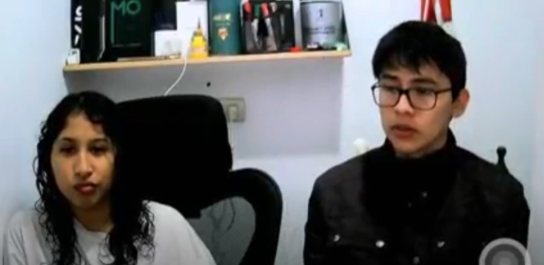

  

<strong>Universidad Peruana de Ciencias Aplicadas</strong>

<strong>Ingeniería de Software</strong> 
Aplicaciones Web  
<strong>Profesor:</strong> Alex Humberto Sánchez Ponce 

<h2 align="center">INFORME</h2>

<h3 align="center">Startup: Qahwa</h3>

<h3 align="center">Team Members:</h3>

| **Member**                      | **Code**   |
| ------------------------------- | ---------- |
| João Otavio de Carvalho Saito   | U202020107 |
| Esteban Valentino Alvarez Falen | U202315628 |
| Stephano Renan Valdivia Quispe  | U202311294 |
| Jhordi Luis Carranza Pérez      | U20191E835 |

<strong>Mayo 2025</strong>

# Project Report Collaboration Insights

Link del repositorio: https://github.com/Qahwa-Grupo3/Report.git

# Capítulo 1: Introducción

## 1.1. Startup Profile

| **Criterio específico**                                               | **Acciones realizadas**                                                                                                                                                                                                                                                                                                                                                                                                                                                                                                                                                                                                                                                                                                                                                                                                                                   | **Conclusiones**                                                                                                                                                                                                                                                                                                                                                                                                                                                                                                                              |
| --------------------------------------------------------------------- | --------------------------------------------------------------------------------------------------------------------------------------------------------------------------------------------------------------------------------------------------------------------------------------------------------------------------------------------------------------------------------------------------------------------------------------------------------------------------------------------------------------------------------------------------------------------------------------------------------------------------------------------------------------------------------------------------------------------------------------------------------------------------------------------------------------------------------------------------------- | --------------------------------------------------------------------------------------------------------------------------------------------------------------------------------------------------------------------------------------------------------------------------------------------------------------------------------------------------------------------------------------------------------------------------------------------------------------------------------------------------------------------------------------------- |
| Comunica oralmente con efectividad a diferentes rangos de audiencia   | **Jhordi Luis Carranza Pérez – TB1:** - Conduje entrevistas a usuarios para profundizar en sus problemas y expectativas. - Presenté hallazgos y propuestas al equipo durante las reuniones sincrónicas.  **João Otavio de Carvalho Saito – TB1:** - Expliqué a los stakeholders la estructura y flujos de la nueva landing page. - Coordiné oralmente la distribución de tareas de diseño con el equipo.  **Esteban Valentino Alvarez Falen – TB1:** - Lideré sesiones de entrevistas al usuario para validar supuestos de valor. - Compartí públicamente los resultados durante la retrospectiva del sprint.  **Stephano Renan Valdivia Quispe – TB1:** - Facilité entrevistas y defendí ajustes en la arquitectura ante el equipo. - Resumí verbalmente los mapas de proceso delante de compañeros y docente. | - Las entrevistas reforzaron mi capacidad para adaptar el lenguaje técnico a usuarios no especialistas y sintetizar ideas en tiempo real. - Aprendí a exponer conceptos visuales (mock-ups, wireframes) de forma clara y a recoger feedback inmediato para iterar rápido. - Desarrollé confianza para dirigir conversaciones guiadas y obtener información crítica manteniendo la atención de la audiencia. - Perfeccioné mi habilidad de traducir datos en narrativas comprensibles para audiencias mixtas (técnicas y de negocio). |
| Comunica por escrito con efectividad a diferentes rangos de audiencia | **Jhordi Luis Carranza Pérez – TB1:** - Elaboré diagramas de flujo y tablas de requerimientos. - Documenté historias de usuario y apuntes de las entrevistas.  **João Otavio de Carvalho Saito – TB1:** - Redacté el contenido textual de la landing page (mensajes de marketing y FAQ). - Diseñé wireframes y mock-ups anotados en Figma.  **Esteban Valentino Alvarez Falen – TB1:** - Construí tablas comparativas y mapas de empatía del usuario. - Documenté los criterios de priorización para el backlog.  **Stephano Renan Valdivia Quispe – TB1:** - Redacté la sección de documentación funcional y mapas de navegación. - Consolidé notas de entrevistas en un reporte de hallazgos.                                                                                                                 | - La redacción estructurada me permitió transmitir información técnica de manera accesible al docente y al equipo de diseño. - Aprendí a comunicar propuestas de valor y guías visuales que cualquier colaborador pueda entender sin asistencia oral. - El uso de plantillas estandarizadas hizo más eficiente el intercambio de información y la toma de decisiones. - Mejoré la coherencia y el nivel de detalle en documentos dirigidos tanto a profesores como a compañeros de distintas áreas.                                  |

### 1.1.1. Descripción de la Startup

**Qahwa** es una startup orientada al desarrollo de soluciones digitales para pequeños y medianos productores de café en el Perú. Nuestro objetivo es digitalizar y optimizar todo el proceso productivo del café (desde la preparación del terreno hasta la comercialización del grano) a través de una aplicación web intuitiva y accesible. Buscamos contribuir al crecimiento del sector cafetalero (recordemos que nuestro país es un importante productor de café en el mundo) brindando herramientas que faciliten el seguimiento de cultivos, el control de cosechas y la mejora en la toma de decisiones comerciales.

**Misión:**  
Impulsar el desarrollo sostenible del sector cafetalero peruano mediante soluciones digitales accesibles e innovadoras que optimicen cada etapa del proceso productivo del café, desde el cultivo hasta su comercialización, empoderando a pequeños y medianos productores con tecnología fácil de usar.

**Visión:**  
Ser la plataforma digital líder en el fortalecimiento del café peruano a nivel nacional e internacional, transformando la manera en que los productores gestionan, controlan y comercializan su café, promoviendo un sector más competitivo, eficiente y justo.

**Valores:**

- **Compromiso con el productor:** Ponemos al caficultor en el centro de nuestras soluciones, entendiendo sus desafíos y necesidades reales.
- **Innovación con propósito:** Desarrollamos herramientas tecnológicas útiles y aplicables al contexto rural y cafetalero peruano.
- **Accesibilidad y simplicidad:** Creamos plataformas intuitivas, pensadas para ser utilizadas sin barreras técnicas.
- **Sostenibilidad:** Promovemos prácticas responsables con el medio ambiente y el desarrollo a largo plazo del sector cafetalero.
- **Transparencia:** Fomentamos procesos claros y decisiones informadas para mejorar la comercialización y confianza en la cadena de valor.
- **Identidad peruana:** Valoramos y promovemos el café peruano como producto de orgullo nacional y de calidad internacional.

### 1.1.2. Perfiles de integrantes del equipo

<table border="1" cellspacing="0" cellpadding="8">
  <tr>
    <td></td>
    <td>
      <strong>Nombres y apellidos:</strong> Jhordi Luis Carranza Pérez 
      <strong>Código de estudiante:</strong> U20191835 
      <strong>Carrera:</strong> Ing. de Software 
      <strong>Descripción:</strong> Soy una persona que me gusta cumplir con mis obligaciones de manera efectiva, aunque muchas veces me descuide un poco. Mis conocimientos técnicos van en torno a Programación Web, bases de datos, lenguajes de alto y bajo rendimiento como C++, Python y JavaScript.
    </td>
  </tr>
  <tr>
    <td></td>
    <td>
      <strong>Nombres y apellidos:</strong> João Otavio de Carvalho Saito 
      <strong>Código de estudiante:</strong> U202020107 
      <strong>Carrera:</strong> Ing. de Software 
      <strong>Descripción:</strong> Soy una persona dedicada, activa y determinada. Muchas veces me sobrecargo de cosas que hacer y termino descuidando los detalles. Tengo conocimientos en C++, Python, Unity y modelado 3D.
    </td>
  </tr>
  <tr>
    <td></td>
    <td>
      <strong>Nombres y apellidos:</strong> Esteban Valentino Alvarez Falen 
      <strong>Código de estudiante:</strong> U202315628 
      <strong>Carrera:</strong> Ing. de Software 
      <strong>Descripción:</strong> Soy estudiante de la UPC de la carrera de ingeniería de software, me encantan los videojuegos y la música, espero terminar a futuro mis metas y lograr todo con satisfacción.
    </td>
  </tr>
  <tr>
    <td></td>
    <td>
      <strong>Nombres y apellidos:</strong> Stephano Renan Valdivia Quispe 
      <strong>Código de estudiante:</strong> U202311294 
      <strong>Carrera:</strong> Ing. de Software 
      <strong>Descripción:</strong> Me considero una persona determinada y paciente. Tengo conocimientos en C++, Python, Java, base de datos, desarrollo web y más.
    </td>
  </tr>
</table>

## 1.2. Solution Profile

### 1.2.1. Antecedentes y problemática

En el Perú, muchos pequeños y medianos productores de café enfrentan grandes desafíos en la gestión de sus procesos agrícolas y comerciales, especialmente en aquellos donde los recursos tecnológicos son limitados o sencillamente no cuentan con ellos. La falta de digitalización de sus cultivos, cosechas y ventas genera pérdidas económicas, baja productividad y una limitada trazabilidad del producto final. Además, los registros manuales son propensos a errores y dificultan la toma de decisiones informadas sobre el negocio cafetalero.

#### Puntos clave a resolver con la solución:

- Digitalizar el registro de actividades de campo (preparación del terreno, siembra, cosecha, etc.).
- Facilitar el seguimiento de procesos en vivero, cultivo, cosecha y postcosecha.
- Automatizar el control de inventario de sacos y estado de humedad del grano.
- Centralizar la información sobre clientes, ventas y precios del café.
- Generar reportes sobre productividad, estado del cultivo y desempeño comercial.

#### Objetivos del proyecto:

- Creación de una página web accesible y fácil de usar para productores de café.
- Ofrecer una interfaz clara que pueda ser usada incluso por usuarios sin experiencia.
- Permitir la visualización de reportes e historial de actividades agrícolas.

#### Restricciones del proyecto:

- El sistema estará enfocado inicialmente en los pequeños productores (sectores rurales del Perú).

### Análisis 5W2H

#### 1. WHO (¿Quién?)

- Pequeños y medianos productores de café en el Perú, principalmente en zonas rurales de la sierra y ceja de selva.
- También incluye técnicos agrícolas, cooperativas cafetaleras e intermediarios en la cadena de valor del café.

#### 2. WHAT (¿Qué?)

- La problemática central es la falta de digitalización y organización en el seguimiento de las etapas del proceso cafetalero (siembra, cultivo, cosecha, poscosecha y venta).
- Esto genera pérdidas económicas, poca trazabilidad del producto, baja eficiencia y dificultades en la toma de decisiones.

#### 3. WHERE (¿Dónde?)

- En las principales regiones productoras de café en el Perú: Cajamarca, Junín, San Martín, Amazonas, Cusco, entre otras.
- Ámbitos rurales con conectividad media o baja, pero con creciente acceso a dispositivos móviles.

#### 4. WHEN (¿Cuándo?)

- El problema ocurre de forma constante a lo largo de todo el año, especialmente en épocas clave como la siembra (marzo-abril) y la cosecha (mayo a octubre).
- La falta de registros históricos afecta tanto la planificación anual como el seguimiento de cada campaña cafetalera.

#### 5. WHY (¿Por qué?)

Porque muchos productores siguen usando registros manuales o no registran nada, debido a:

- Limitado acceso a herramientas tecnológicas adaptadas a su realidad.
- Falta de capacitación digital.
- Sistemas existentes demasiado complejos o costosos.

#### 6. HOW (¿Cómo sucede?)

- El productor realiza labores de campo sin una bitácora formal.
- No recuerda fechas exactas de fertilización, poda o tratamientos fitosanitarios.
- Al llegar la cosecha, vende su café sin poder demostrar la calidad del proceso, lo que disminuye su capacidad de negociación en el mercado.
- Las ventas no quedan registradas y se pierde información valiosa para la trazabilidad del producto o evaluación del negocio.

#### 7. HOW MUCH (¿Cuánto afecta?)

- Según el MINAGRI, el 95% de los productores son pequeños agricultores, y muchos de ellos pierden entre 15% y 30% de su producción potencial por mala planificación o manejo técnico deficiente.
- Además, la falta de trazabilidad limita su acceso a mercados premium o exportadores, donde podrían vender su café a precios mucho más altos.

### 1.2.2 Lean UX Process

El enfoque Lean UX aplicado en este proyecto nos ha permitido definir una visión clara del modelo de negocio, identificar con precisión los problemas del usuario y plantear hipótesis que guíen el desarrollo de un sistema centrado en las necesidades reales de los productores cafetaleros.

#### 1.2.2.1 Lean UX Problem Statements

- **Domain (Dominio del problema):**  
  El dominio del problema es la gestión de procesos agrícolas y de comercialización en la producción de café peruano, especialmente en manos de pequeños productores con recursos limitados y sin acceso a herramientas digitales especializadas.

- **Customer Segments (Segmentos de clientes):**

  - Pequeños productores de café.
  - Técnicos agrícolas y asociaciones/cooperativas cafetaleras.
  - Intermediarios y compradores.

- **Pain Points (Puntos de dolor):**

  - Falta de digitalización en el control de procesos agrícolas.
  - Escasa trazabilidad de la producción de café.
  - Dificultades para registrar y analizar actividades agrícolas.
  - Pérdida de oportunidades comerciales por no demostrar calidad del café.

- **Gap (Brecha identificada):**  
  Existe una desconexión entre el potencial del café peruano y la forma en que se gestiona su producción y venta, debido a la ausencia de herramientas tecnológicas simples, accesibles y adaptadas al entorno rural.

- **Vision / Strategy:**  
  Desarrollar una plataforma web accesible y fácil de usar, que permita a los caficultores registrar, organizar y monitorear todo el ciclo de producción y comercialización de su café, desde la siembra hasta la venta, fortaleciendo la trazabilidad, eficiencia y el acceso a mercados de valor.

- **Initial Segment:**  
  Nos enfocaremos inicialmente en productores cafetaleros de la región Cajamarca, que representan uno de los focos más importantes de producción nacional y tienen un alto nivel de organización local a través de cooperativas y asociaciones.

#### 1.2.2.2 Lean UX Assumptions

- Los productores cafetaleros están interesados en mejorar la gestión de sus cultivos y ventas.
- La mayoría cuenta con acceso a un celular con internet o a centros de conectividad cercanos.
- Prefieren soluciones simples, visuales y adaptadas a su nivel de alfabetización digital.
- Las cooperativas o técnicos agrícolas pueden cumplir un rol clave en la adopción inicial del sistema.
- Existe mercado para el café con trazabilidad comprobada.

#### 1.2.2.3 Lean UX Hypothesis Statements

- Si brindamos una plataforma web fácil de usar para registrar las actividades agrícolas, los productores cafetaleros podrán llevar un mejor control de su producción y reducir pérdidas por desorganización.

- Si los productores pueden demostrar la trazabilidad de su café, tendrán más oportunidades para acceder a mercados con mejores precios.

- Si los técnicos agrícolas pueden supervisar múltiples parcelas desde el sistema, se optimizará la asistencia técnica y el rendimiento productivo.

- Si los compradores tienen acceso a información detallada de cada lote de café, confiarán más en el producto y establecerán relaciones comerciales más directas y justas.

#### 1.2.2.4. Lean UX Canvas.

  

## 1.3 Segmentos Objetivos

### Segmento 1: Pequeños productores de café

**Descripción:**  
Agricultores que cultivan café a pequeña escala, generalmente en parcelas familiares de menos de 5 hectáreas. Utilizan métodos tradicionales y, en muchos casos, forman parte de cooperativas o asociaciones.

**Características con información estadística:**

- **Edad:**

  - Entre 25 y 50 años (mayoría de la PEA agrícola rural).
  - Según el Censo Agropecuario del Perú (2012), el 60% de los productores agropecuarios están en este rango de edad.

- **Nivel educativo:**

  - 47.5% de los productores agrícolas tienen primaria completa o incompleta.
  - 36% alcanzó secundaria (INEI – Censo Agropecuario, 2012).

- **Ubicación:**

  - Zonas de alta producción cafetalera:
    - Cajamarca (21%)
    - San Martín (19%)
    - Junín (15%)
    - Cuzco (9%)  
      _(Fuente: Junta Nacional del Café, 2023)_
  - Predominan en zonas rurales de sierra y ceja de selva.

- **Conectividad:**
  - Solo el 30% de hogares rurales tiene acceso a internet.
  - El 70% de los productores usa celulares, y el uso de smartphones está en aumento.  
    _(Fuente: INEI – Encuesta Nacional de Hogares, 2022)_
  - Acceso creciente a plataformas como WhatsApp, Facebook y navegador móvil.

### Segmento 2: Compradores

**Descripción:**  
Personas naturales o jurídicas que adquieren café en grano para acopiarlo, procesarlo, comercializarlo localmente o exportarlo. Pueden operar individualmente o formar parte de cooperativas o compañías exportadoras.

**Características con información estadística:**

- **Edad:**

  - Entre 30 y 55 años.
  - Este rango coincide con la edad promedio de los micro y pequeños empresarios en Perú.  
    _(Fuente: Produce – 2021)_

- **Ubicación:**

  - Principalmente en ciudades intermedias cercanas a zonas productoras:
    - Jaén (Cajamarca)
    - Tarapoto (San Martín)
    - Satipo (Junín)
    - Quillabamba (Cusco)
  - También se ubican en centros de acopio, puertos o zonas industriales de:
    - Lima
    - Callao
    - Arequipa
    - Chiclayo
    - Trujillo

- **Conectividad:**
  - Alta.
  - Más del 85% de las MYPES en zonas urbanas usan internet.  
    _(Fuente: INEI, 2022)_
  - Acceso a computadoras, redes móviles, plataformas de comercio electrónico y herramientas de trazabilidad y logística.

# Capítulo 2: Requirements Elicitation & Analysis

## 2.1 Competidores

En el análisis de mercado hemos identificado una serie de competidores que ofrecen soluciones digitales enfocadas en la gestión agrícola o en la cadena de comercialización del café. A continuación, se presentan tres de los principales competidores directos e indirectos, junto con una breve descripción de sus modelos de negocio y su relación con el dominio de nuestro proyecto:

### 1. Agrovision

**Tipo:** Competidor directo  
**Descripción:**  
Plataforma digital orientada al monitoreo y gestión de cultivos agrícolas. Permite registrar actividades de campo, generar reportes de productividad y controlar plagas y enfermedades mediante sensores y aplicaciones móviles.

**Relación con el proyecto:**  
Tiene funciones de monitoreo agrícola, similares a las que proponemos, aunque enfocadas principalmente en grandes empresas agroexportadoras. No está adaptada a pequeños productores cafetaleros ni considera el proceso de comercialización.

### 2. Digital Coffee Future

**Tipo:** Competidor directo  
**Descripción:**  
Startup internacional que busca digitalizar la cadena de valor del café. Ofrece soluciones para rastrear la producción desde el campo hasta el comprador final, con enfoque en trazabilidad, sostenibilidad y comercio justo.

**Relación con el proyecto:**  
Aborda un enfoque similar al nuestro, pero su alcance es global y se enfoca en exportadores y empresas con mayor capacidad tecnológica. Nuestro sistema se diferencia por centrarse en productores locales peruanos con herramientas más sencillas y accesibles.

### 3. Jiwa+ (de Rikolto)

**Tipo:** Competidor indirecto  
**Descripción:**  
Aplicación desarrollada en colaboración con asociaciones agrícolas en Perú. Permite llevar un registro de actividades, gestión de parcelas, producción y ventas para pequeños agricultores.

**Relación con el proyecto:**  
Es una solución que se aproxima al modelo que proponemos, pero aún está en etapas limitadas de adopción. No está especializada en el rubro del café ni ha sido diseñada específicamente para la cadena completa del proceso cafetalero.

### 2.1.1. Análisis competitivo.

¿Por qué llevar a cabo este análisis? Este análisis busca comprender a fondo el entorno competitivo en el que se posiciona nuestra startup cafetalera, identificando fortalezas y debilidades de los principales actores del mercado. Esto permitirá afinar nuestra propuesta de valor, descubrir oportunidades de diferenciación y definir una estrategia competitiva efectiva.

#### Cuadro Comparativo de Competidores

| Categoría                    | Nuestra Startup (Qahwa)                                                                           | Agrovisión (Competidor)                                           | Digital Coffee Future (Competidor)                               | Jiwa+ (Competidor)                                 |
| ---------------------------- | ------------------------------------------------------------------------------------------------- | ----------------------------------------------------------------- | ---------------------------------------------------------------- | -------------------------------------------------- |
| **Perfil Overview**          | Plataforma de gestión del café desde el cultivo hasta la venta, enfocada en productores peruanos. | Plataforma de monitoreo y gestión agrícola para agroexportadores. | Solución de trazabilidad digital para la cadena global del café. | App para gestión de actividades agrícolas locales. |
| **Ventaja competitiva**      | Integración completa y simple para cafetaleros locales.                                           | Gestión agrícola con sensores y reportes avanzados.               | Transparencia en la cadena de valor para exportadores.           | Acompañamiento a asociaciones rurales.             |
| **Mercado objetivo**         | Pequeños y medianos caficultores peruanos.                                                        | Grandes empresas agroindustriales.                                | Empresas exportadoras y compradores internacionales.             | Agricultores rurales organizados en asociaciones.  |
| **Estrategias de marketing** | Capacitación, ferias agrícolas, asociaciones cafetaleras.                                         | Venta directa a empresas y uso de redes de distribuidores.        | Alianzas internacionales, enfoque en sostenibilidad.             | ONG y redes locales de confianza.                  |
| **Productos & Servicios**    | Gestión de cultivo, cosecha, procesamiento, ventas y stock.                                       | Sensores, reportes de productividad, control fitosanitario.       | Plataforma de trazabilidad, reportes, certificaciones.           | Registro de actividades, gestión de parcelas.      |
| **Precios & Costos**         | Modelo freemium con pagos por funciones avanzadas.                                                | Costos altos, orientado a empresas con presupuesto.               | Precio en función del tamaño y nivel de exportación.             | Bajo costo, subsidiado por ONG.                    |
| **Canales de distribución**  | Web y aplicación móvil adaptada a zonas rurales.                                                  | Web + plataforma en la nube.                                      | Web, móvil y API para integraciones.                             | Aplicación móvil offline.                          |

#### Análisis SWOT

| **Categoría**     | **Nuestra Startup (Qahwa)**                                           | **Agrovision (Competidor)**                   | **Digital Coffee Future (Competidor)**              | **Jiwa+ (Competidor)**                         |
| ----------------- | --------------------------------------------------------------------- | --------------------------------------------- | --------------------------------------------------- | ---------------------------------------------- |
| **Fortalezas**    | Adaptada al cafetalero peruano, interfaz sencilla, bajo costo.        | Alta tecnología, sensores, informes técnicos. | Experiencia global, fuerte enfoque en trazabilidad. | Apoyo comunitario, diseñada para asociaciones. |
| **Debilidades**   | Poco reconocimiento inicial, recursos limitados.                      | No está diseñada para pequeños productores.   | Requiere conectividad y conocimientos digitales.    | Alcance limitado a ciertas zonas rurales.      |
| **Oportunidades** | Alta demanda de digitalización en cafetaleros locales, apoyo estatal. | Expansión a nuevos cultivos.                  | Certificaciones ecológicas y comercio justo.        | Escalamiento a otras regiones agrícolas.       |
| **Amenazas**      | Entrada de nuevas startups, resistencia tecnológica en zonas rurales. | Saturación de tecnologías avanzadas.          | Cambios regulatorios o falta de adopción local.     | Dependencia de subvenciones y ONG.             |

### 2.1.2. Estrategias y tácticas frente a competidores.

Para enfrentar las fortalezas y debilidades de los competidores, así como aprovechar el contexto de oportunidades y amenazas, nuestra startup Qahwa aplicará las siguientes estrategias y tácticas:

#### **Diferenciación basada en accesibilidad y enfoque local:**

- Desarrollar una interfaz sencilla y amigable incluso para caficultores con bajo nivel de alfabetización digital.
- Brindar soporte técnico y capacitaciones personalizadas en zonas rurales, en alianza con cooperativas cafetaleras.

#### **Alianzas estratégicas:**

- Colaborar con ONG, municipios rurales y programas del Estado para facilitar la implementación del sistema.
- Buscar convenios con asociaciones de cafetaleros para crear redes de usuarios beta que validen y promuevan la solución.

#### **Modelo de negocio adaptable y escalable:**

- Implementar un modelo freemium que permita adopción inicial sin costos, con mejoras pagadas según necesidades.
- Diseñar funciones modulares que puedan escalar conforme crezcan los negocios de los productores.

#### **Marketing dirigido y presencia comunitaria:**

- Participar en ferias agrícolas, talleres y eventos rurales para generar confianza y visibilidad.
- Generar contenido educativo sobre buenas prácticas cafetaleras integradas al uso de la app.

#### **Monitoreo continuo del mercado y ajustes estratégicos:**

- Realizar retroalimentación constante con usuarios para adaptar el producto a sus cambios de contexto.
- Monitorear innovaciones tecnológicas de competidores para evaluar adaptaciones necesarias.

Con estas estrategias, Qahwa busca posicionarse como una solución integral, accesible y confiable para los caficultores peruanos, transformando digitalmente su cadena de valor con enfoque local y comunitario.

## 2.2. Entrevistas

Las entrevistas fueron diseñadas con el fin de poder conocer a profundidad al usuario: necesidades, temores, acciones y demás factores.

### 2.2.1. Diseño de entrevistas

#### **Segmento 1: Productores de café**

**Objetivo:** Conocer a fondo sus procesos, retos, herramientas actuales, necesidades, perfil demográfico y digital.

**Información a recolectar:**

- Edad, género, distrito o zona rural de residencia, ocupación, años de experiencia.
- Objetivos, frustraciones, nivel de digitalización, canales de venta, dispositivos que usa.
- Estilo de vida, nivel de educación, influencias.

**Preguntas principales:**

1. ¿Cuántos años lleva produciendo café?
2. ¿Cómo es el proceso que sigue desde la siembra hasta la venta del café?
3. ¿Qué herramientas usa actualmente para gestionar sus cultivos y ventas?
4. ¿Con qué frecuencia enfrenta problemas relacionados al manejo de plagas o clima?
5. ¿Cómo realiza actualmente sus ventas? ¿A quién le vende y cómo negocia precios?
6. ¿Qué tan fácil o difícil le resulta encontrar compradores?
7. ¿Usa algún tipo de tecnología (apps, redes sociales, hojas de cálculo)?
8. ¿Cuáles son sus principales preocupaciones o frustraciones en el proceso de producción y comercialización?

**Preguntas complementarias:**

1. ¿Ha recibido capacitaciones o asistencia técnica en los últimos años?
2. ¿Qué medio usa más: celular, laptop, radio, etc.?
3. ¿Qué haría si tuviera una herramienta digital para mejorar sus ventas y gestión?
4. ¿Qué canales digitales (WhatsApp, Facebook, etc.) usa con más frecuencia?
5. ¿Tiene acceso a internet con frecuencia? ¿Qué tan bueno es ese acceso?

#### **Segmento 2: Compradores**

**Objetivo:** Entender cómo compran, qué valoran del producto, su perfil de compra, necesidades digitales y relación con los productores.

**Información a recolectar:**

- Edad, género, ubicación, tipo de empresa o negocio.
- Canales y criterios de compra, herramientas digitales usadas, frustraciones.
- Personalidad, objetivos, marca preferida, experiencia en el rubro.

**Preguntas principales:**

1. ¿A qué tipo de productores suele comprar café?
2. ¿Cómo identifica o contacta a nuevos proveedores?
3. ¿Qué aspectos valora más al momento de comprar café? (Precio, calidad, origen, certificación, etc.)
4. ¿Qué dificultades enfrenta al negociar o cerrar una venta?
5. ¿Qué herramientas usa para gestionar sus compras y contactos?
6. ¿Ha tenido problemas con la trazabilidad o calidad del café que adquiere?
7. ¿Qué espera de una solución digital que facilite su proceso de compra?

**Preguntas complementarias:**

1. ¿Con qué frecuencia compra café y en qué volumen?
2. ¿Usa algún sistema o app para gestionar proveedores?
3. ¿Estaría dispuesto a usar una plataforma que conecte directamente con pequeños productores?
4. ¿Qué canales digitales usa más? (Correo, WhatsApp, páginas web, apps)

### 2.2.2. Registro de entrevistas.

#### Segmento 1: Productores

##### Entrevista a Denis Monsalve:

  

https://upcedupe-my.sharepoint.com/personal/u20191e835_upc_edu_pe/_layouts/15/stream.aspx?id=%2Fpersonal%2Fu20191e835%5Fupc%5Fedu%5Fpe%2FDocuments%2FEntrevista%20%2D%20S1%20%2D%20Web%2Emp4&referrer=StreamWebApp%2EWeb&referrerScenario=AddressBarCopied%2Eview%2Ef32c75a0%2D5bbd%2D4c60%2Da277%2D0b9464b8397b&isDarkMode=false

##### Entrevista a José Carranza:

  

https://upcedupe-my.sharepoint.com/personal/u20191e835_upc_edu_pe/_layouts/15/stream.aspx?id=%2Fpersonal%2Fu20191e835%5Fupc%5Fedu%5Fpe%2FDocuments%2FEntrevista%20a%20Productor%20%2D%20By%20Jhordi%20Carranza%2Emp4&referrer=StreamWebApp%2EWeb&referrerScenario=AddressBarCopied%2Eview%2Ea45f877c%2Da8e7%2D4db0%2D8e5f%2D83b80120a207&isDarkMode=false

#### Segmento 2: Distribuidores

##### Entrevista a Flores:

  

https://upcedupe-my.sharepoint.com/personal/u202315628_upc_edu_pe/_layouts/15/stream.aspx?id=%2Fpersonal%2Fu202315628%5Fupc%5Fedu%5Fpe%2FDocuments%2Fentrevistas%2FCompradores%2Emkv&referrer=StreamWebApp%2EWeb&referrerScenario=AddressBarCopied%2Eview%2E304b7774%2D5c27%2D47c1%2D842b%2D9fbe94002739&isDarkMode=false

##### Entrevista a Ania:

  

https://upcedupe-my.sharepoint.com/personal/u20191e835_upc_edu_pe/_layouts/15/stream.aspx?id=%2Fpersonal%2Fu20191e835%5Fupc%5Fedu%5Fpe%2FDocuments%2FEntrevista%20%E2%80%90%20Ania%20paredez%2Emp4&referrer=StreamWebApp%2EWeb&referrerScenario=AddressBarCopied%2Eview%2Ea3299a8b%2Da24c%2D4295%2Da4f8%2Def90b8481258&isDarkMode=false

##### Entrevista a Name:

  

Link

### 2.2.3. Análisis de entrevistas

#### Segmento 1: Productores de Café

##### 1. Procesos y herramientas actuales

- Todos los productores siguen un proceso tradicional: **siembra → cultivo → cosecha manual → secado → venta en pergamino o verde**.
- Herramientas actuales: cuadernos físicos para apuntes, **WhatsApp** para comunicarse con clientes, y en el caso de _Mariela_, **Excel básico en una laptop**.
- El acceso a tecnología es limitado.

##### 2. Problemas y necesidades

- **Manejo de plagas y clima**: enfrentan problemas frecuentes, sobre todo en época de lluvias.
- **Ventas**: venden principalmente a intermediarios. El precio lo pone usualmente el comprador.
- **Dificultades para encontrar compradores**: les frustra que no haya transparencia en el precio final del café.

##### 3. Digitalización y conectividad

- Todos tienen celular, pero solo Mariela usa internet de manera frecuente (datos móviles).
- **Dispositivos principales**: smartphone con acceso a redes.
- **Canales más usados**: WhatsApp, Facebook.
- Todos estarían interesados en una herramienta sencilla para vender y registrar producción, pero temen no entender cómo usarla.

##### 4. Principales frustraciones

- Falta de compradores confiables.
- Pérdida de café por mal manejo poscosecha.
- No saber cuánto vale realmente su café en el mercado final.
- Dificultades para llevar registros precisos de su producción.

#### Segmento 2: Distribuidores de Café

##### 1. Perfil de compra y criterios

- **Productores habituales**: pequeños y medianos, con cafés especiales o certificados.
- **Criterios de compra**: calidad en taza, origen, trazabilidad, y certificación. El precio también importa.

##### 2. Relación con productores

- Contactan a productores por recomendaciones, ferias o WhatsApp.
- Hay una necesidad recurrente de conocer más productores confiables por zona.
- _Lucía_ menciona que es difícil saber quién tiene café disponible y cuándo.

##### 3. Frustraciones

- **Trazabilidad**: difícil saber el lote exacto de origen o cómo fue producido.
- **Negociación**: lentitud en la respuesta o falta de datos claros (variedad, proceso, disponibilidad).
- Falta de una plataforma centralizada donde puedan explorar opciones de compra rápida y confiable.

##### 4. Digitalización

- Todos usan sistemas básicos (Excel o ERP) para gestionar inventarios y pagos.
- **WhatsApp y correo electrónico** son los principales medios de contacto.

##### 5. Necesidades clave

- Plataforma con filtros por zona, tipo de café y certificaciones.
- Sistema que muestre disponibilidad en tiempo real y facilite pedidos directos.
- Historial del productor y trazabilidad del lote.

## 2.3. Needfinding

Las necesidades principales que hemos encontrado en nuestros segmentos objetivos propuestos son:

### Primer segmento: Productores de café:

- Conectar con compradores o distribuidores sin necesidad de intermediarios abusivos.
- Mostrar su producción disponible, calidad del café, certificaciones, etc.
- Facilitar la coordinación de transporte para enviar su café.
- Llevar un control básico de inventario.
- Registrar cuánto café producen, cuándo cosechan, cuánto tienen disponible.
- Acceso a contenidos sobre buenas prácticas agrícolas, certificaciones (orgánico, comercio justo), manejo de plagas, etc.

### Segundo segmento: Distribuidores de café:

- Geolocalización o listado de productores por zona, tipo de café, volumen disponible.
- Ver disponibilidad de café, hacer pedidos directamente desde la app.
- Coordinar tiempos de recojo, entregas y pagos.
- Registrar de dónde viene el café (finca, productor, lote) para ofrecer transparencia a sus compradores.

## 2.3.1. User Personas

El objetivo de estos arquetipos es representar de manera empática a nuestros usuarios clave y guiar el diseño centrado en sus necesidades reales. Los User Personas nos permitirán tomar decisiones de diseño, funcionalidades y estrategias alineadas con las motivaciones, frustraciones, habilidades tecnológicas y hábitos de cada perfil.

### Primer Segmento Objetivo: Productores de Café

  

### Segundo Segmento Objetivo: Distribuidores de Café

  

### 2.3.2. User Task Matrix.

Para el desarrollo de esta matriz de tareas, se han considerado los dos segmentos objetivo representados en los User Persona:
Don Juan Ramos: pequeño productor de café de la sierra peruana.
Lucía Fernández: compradora para una empresa tostadora de café de especialidad.
El objetivo de esta matriz es identificar qué tareas realizan estos perfiles en relación con la producción y venta de café, evaluando la frecuencia y la importancia de dichas tareas, de forma independiente a la existencia de una solución digital. Esta información nos permitirá comprender mejor sus prioridades y necesidades reales, y servirá de guía para el diseño del producto.

### Tareas - Productores de Café

| Tarea                                     | Frecuencia | Importancia |
| ----------------------------------------- | ---------- | ----------- |
| Preparar el terreno y sembrar café        | Alta       | Alta        |
| Cuidar y monitorear el cultivo            | Alta       | Alta        |
| Realizar la cosecha                       | Alta       | Alta        |
| Procesar el café (lavado, secado, etc.)   | Alta       | Alta        |
| Empaquetar y almacenar el café            | Media      | Alta        |
| Buscar canales de venta                   | Alta       | Alta        |
| Negociar precios con compradores          | Media      | Alta        |
| Transportar el café a los puntos de venta | Media      | Media       |
| Usar redes y plataformas digitales        | Baja       | Media       |
| Verificar calidad y procedencia del café  | Media      | Alta        |
| Hacer seguimiento postventa o reclamos    | Baja       | Media       |

### Tareas - Distribuidores de Café

| Tarea                                    | Frecuencia | Importancia |
| ---------------------------------------- | ---------- | ----------- |
| Contactar nuevos productores/proveedores | Alta       | Alta        |
| Verificar calidad y procedencia del café | Alta       | Alta        |
| Negociar precios con productores         | Alta       | Alta        |
| Procesar el café (post-compra)           | Media      | Alta        |
| Empaquetar y almacenar el café           | Media      | Alta        |
| Buscar canales de venta                  | Alta       | Alta        |
| Hacer seguimiento postventa o reclamos   | Media      | Alta        |
| Usar redes o plataformas digitales       | Alta       | Alta        |
| Realizar visitas técnicas o inspecciones | Media      | Alta        |
| Analizar muestras y pruebas de calidad   | Alta       | Alta        |
| Investigar tendencias de consumo         | Media      | Media       |

### 2.3.3. User Journey Mapping.

#### Segmento 1:

  

#### Segmento 2:

  

### 2.3.4. Empathy Mapping.

  

  

### 2.3.5. As-is Scenario Mapping.

#### Productores de café:

### Phases - Productores de Café

| Fase              | Doing                                     | Thinking                                               | Feeling                                   |
| ----------------- | ----------------------------------------- | ------------------------------------------------------ | ----------------------------------------- |
| **Siembra**       | - Prepara la tierra manualmente.          | - "¿La tierra estará lista a tiempo?"                  | - Esperanza                               |
|                   | - Selecciona semillas.                    | - "¿Las semillas germinan bien?"                       | - Ansiedad por las condiciones climáticas |
|                   | - Planta las semillas.                    | - "¿Las plagas afectarán mi cultivo?"                  | - Estrés                                  |
|                   | - Riega las plantas.                      | - "¿Podré mantener el ritmo de trabajo?"               | - Fatiga                                  |
|                   | - Aplica métodos caseros para las plagas. | - "Debo ser rápido para evitar pérdidas."              | - Preocupación constante                  |
|                   | - Limpia el terreno.                      |                                                        |                                           |
| **Cuidado**       | - Cosecha manualmente los granos maduros. | - "¿La calidad será buena?"                            | - Ansiedad                                |
|                   | - Clasifica el café.                      | - "¿El secado será suficiente para conservar calidad?" | - Presión por el tiempo                   |
| **Cosecha**       | - Seca el café al sol.                    | - "¿Tendré pérdidas?"                                  | - Satisfacción parcial                    |
| **Procesamiento** | - Limpia y almacena el café.              |                                                        | - Frustración                             |
|                   | - Prepara el café para la venta.          |                                                        | - Inseguridad                             |
| **Thinking**      | -                                         |                                                        | - Cansancio                               |

#### Distribuidores de café:

### Phases - Distribuidores de Café

| Fase                                | Doing                                                   | Thinking                                                         | Feeling                                                     |
| ----------------------------------- | ------------------------------------------------------- | ---------------------------------------------------------------- | ----------------------------------------------------------- |
| **Buscar proveedores y contactos**  | - Asistir a ferias de café.                             | - "¿Este proveedor tiene buena calidad y prácticas?"             | - Esperanza de encontrar buenos proveedores.                |
|                                     | - Contactar cooperativas y asociaciones.                | - "¿Puedo confiar en la sostenibilidad del producto?"            | - Interés por conocer más sobre los productores.            |
| **Negociar y comprar café**         | - Negociar precios y condiciones vía WhatsApp y correo. | - "¿El precio es justo? ¿Podrán cumplir con los tiempos?"        | - Frustración por negociaciones complicadas.                |
|                                     |                                                         | - "¿Podrán cumplir con los tiempos de entrega?"                  | - Ansiedad por cumplir con las demandas de los clientes.    |
| **Gestionar compras y calidad**     | - Solicitar y revisar muestras de café.                 | - "¿Cómo asegurar que el café entregado sea igual a la muestra?" | - Inseguridad por problemas de trazabilidad y calidad.      |
|                                     | - Registrar datos en Excel y CRM básico.                | - "¿Cómo mantener un historial claro y actualizado?"             | - Preocupación por la satisfacción del cliente final.       |
|                                     | - Comparar muestras con el café recibido.               |                                                                  |                                                             |
|                                     | - Mantener comunicación constante por WhatsApp.         |                                                                  |                                                             |
| **Comunicar y mantener relaciones** | - Enviar correos formales a proveedores grandes.        | - "¿Cómo mejorar la comunicación para evitar malentendidos?"     | - Estrés por falta de información centralizada y confianza. |
|                                     |                                                         | - "¿Cómo mantener la confianza con los proveedores?"             | - Deseo de una solución digital confiable y fácil de usar.  |

## 2.4. Ubiquitous Language.

### Actores principales:

### Términos Clave - Definiciones

| English Term    | Término en Español | Definición                                                                                                          |
| --------------- | ------------------ | ------------------------------------------------------------------------------------------------------------------- |
| **Producer**    | Productor          | Persona o familia que cultiva y cosecha café. Puede registrar su finca, producción y conectarse con distribuidores. |
| **Distributor** | Distribuidor       | Persona o empresa que compra café a los productores para venderlo, transportarlo o procesarlo.                      |
| **User**        | Usuario            | Cualquier persona registrada en la app, ya sea productor o distribuidor.                                            |

### Entidades y Conceptos Clave

| English Term         | Término en Español  | Definición                                                                                                            |
| -------------------- | ------------------- | --------------------------------------------------------------------------------------------------------------------- |
| **Coffee Lot**       | Lote de Café        | Cantidad de café disponible para la venta, con información de peso, calidad, tipo y fecha de cosecha.                 |
| **Farm**             | Finca               | Terreno donde se cultiva el café. Se asocia al productor y contiene información sobre su ubicación y características. |
| **Inventory**        | Inventario          | Registro del café disponible en stock del productor.                                                                  |
| **Coffee Offer**     | Oferta de Café      | Publicación del productor en la app para ofrecer un lote de café a la venta.                                          |
| **Order**            | Pedido              | Solicitud formal que hace un distribuidor para comprar uno o más lotes de café.                                       |
| **Scheduled Pickup** | Recojo Programado   | Fecha y lugar acordados para que el distribuidor recoja el café del productor.                                        |
| **Collection Route** | Ruta de Recolección | Ruta planificada para recoger café de varios productores de forma eficiente.                                          |
| **Fair Price**       | Precio Justo        | Valor mínimo recomendado para que el productor reciba un pago adecuado por su café.                                   |
| **Certification**    | Certificación       | Acreditación que valida ciertas condiciones del café, como ser orgánico o de comercio justo.                          |
| **Harvest Record**   | Registro de Cosecha | Información ingresada por el productor sobre una jornada o temporada de recolección.                                  |
| **Digital Contract** | Contrato Digital    | Acuerdo entre productor y distribuidor validado en la app con condiciones claras y registro digital.                  |

### Funcionalidades / Acciones

| English Term              | Término en Español     | Definición                                                               |
| ------------------------- | ---------------------- | ------------------------------------------------------------------------ |
| **Publish Offer**         | Publicar Oferta        | Acción del productor para ofrecer un lote de café a través de la app.    |
| **Search Coffee**         | Buscar Café            | Acción del distribuidor para encontrar ofertas según filtros.            |
| **Send Order**            | Enviar Pedido          | Solicitud formal de compra enviada por el distribuidor.                  |
| **Confirm Order**         | Confirmar Pedido       | Aceptación del pedido por parte del productor o distribuidor.            |
| **Register Pickup**       | Registrar Recojo       | Confirmación de que el café fue recogido según lo acordado.              |
| **Upload Evidence**       | Subir Evidencia        | Cargar fotos o documentos como prueba de calidad, recolección o entrega. |
| **Chat**                  | Chatear                | Comunicación directa entre productor y distribuidor dentro de la app.    |
| **View Market Prices**    | Ver Precio de Mercado  | Consultar precios actuales del café según zona, tipo y mercado.          |
| **Receive Notifications** | Recibir Notificaciones | Alertas sobre pedidos, precios, ofertas y recojos.                       |

### Interfaz y Sistema

| English Term              | Término en Español     | Definición                                                              |
| ------------------------- | ---------------------- | ----------------------------------------------------------------------- |
| **Producer Dashboard**    | Panel del Productor    | Vista principal del productor con su producción, inventario y pedidos.  |
| **Distributor Dashboard** | Panel del Distribuidor | Vista principal del distribuidor con pedidos, rutas y productores.      |
| **Interactive Map**       | Mapa Interactivo       | Herramienta visual para localizar fincas y planificar rutas.            |
| **Offline Mode**          | Modo Sin Conexión      | Funcionalidad que permite usar la app sin internet y sincronizar luego. |
| **Learning Center**       | Centro de Aprendizaje  | Sección con guías, videos y materiales educativos para productores.     |
| **Preferred Language**    | Idioma Preferido       | Opción de usar la app en español, quechua u otro idioma local.          |
